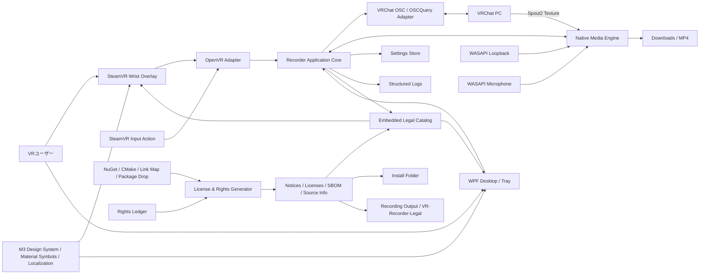
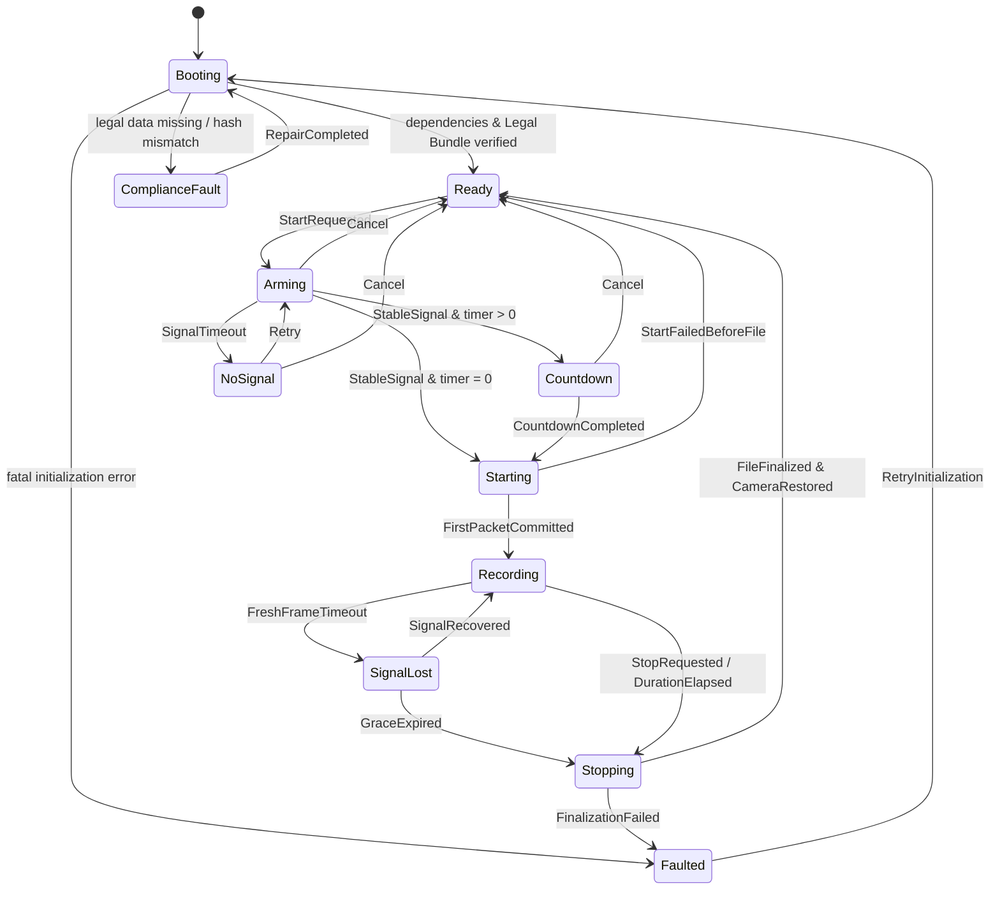
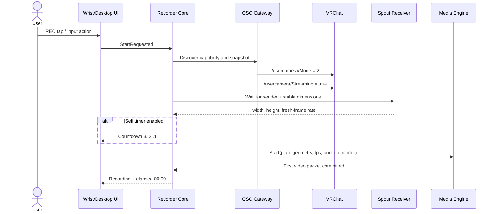
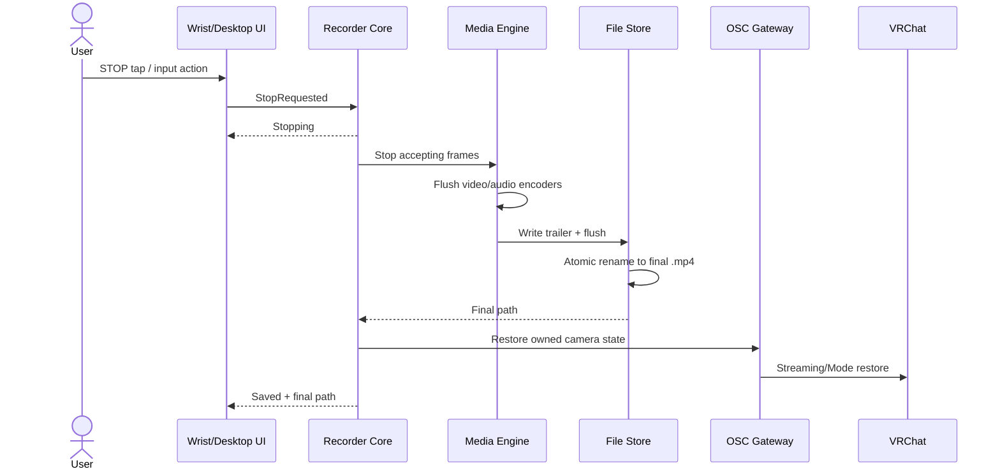

# VR-Recorder 基本設計書

- 文書版: 0.3
- 作成日: 2026-07-10
- 最終改訂日: 2026-07-10
- 対象: Windows 10 / Windows 11、SteamVR、VRChat PC版
- ステータス: 実装開始前の推奨設計（第三者ライセンス・権利保護・Material Design 3・国際化要件反映済み）
- 改訂内容: Material Symbols採用、Apache-2.0自動通知、Material Design 3全項目の適用性台帳、XR向けM3設計、録画専用semantic color、非drag操作、言語非依存UI、日英README、アイコン資産の固定・検証・オフライン配布を追加

---

## 0. 設計結論

VR-Recorder は、**.NET 10 / WPF / x64 のモジュラーモノリス**として実装する。録画状態管理、設定、デスクトップUI、SteamVR手首UIのViewModel、OSC制御、ユースケースはC#で実装し、Spout2、OpenVR、D3D11、WASAPI、FFmpegを扱う部分だけを、バージョン付きC ABIのネイティブブリッジに隔離する。

採用する主要方針は次のとおり。

1. VRChatカメラはOSCの `/usercamera/Mode=2` と `/usercamera/Streaming=true/false` で制御する。
2. VRChatのSpout解像度を返すOSC項目はないため、**Spout受信テクスチャの実寸を映像仕様の正とする**。
3. 録画開始時に入力寸法を安定判定し、出力MP4を同寸法で開始する。幅より高さが大きければ縦動画として扱う。
4. 録画中の解像度変更は、単一MP4の互換性を優先する標準モードでは、開始時キャンバスへアスペクト比を保ってフィットする。入力寸法へ厳密に追従するモードでは、変更点でMP4を自動分割する。
5. 映像はH.264、音声はAAC-LC、コンテナはMP4とする。初期フレームレートは30 fps、設計上は30～120 fpsを扱えるようにする。
6. エンコーダーは実エンコード試験で選択し、NVENC、AMF、QSV、Media FoundationソフトウェアH.264の順ではなく、**Spoutテクスチャと同一GPU上で利用可能な実装を優先**する。
7. デスクトップ音声はWASAPIループバック、マイクはWASAPIキャプチャで取得し、48 kHzへ統一してミックスする。
8. 手首UIはVRChat内オブジェクトではなく、SteamVRのOpenVR Overlayとして実装する。録画物には映り込まない。
9. コア制御は単一の直列化された状態機械で行い、二重タップ、停止競合、タイマー競合、信号断を決定論的に処理する。
10. t-wada式のRed–Green–Refactorを採用し、結合テスト実行だけで主要assemblyおよびnative第一者コードの行・分岐カバレッジ各80%以上をマージ条件とする。
11. 配布する全第三者コンポーネントについて、SPDX識別子、著作権表示、ライセンス全文、改変有無、リンク形態、正確なバージョン／commit、ソース対応物を単一台帳から生成し、`THIRD-PARTY-NOTICES` とSBOMとして必ず同梱する。
12. 第三者ライセンスはSteamVR手首UI、デスクトップUI、インストールフォルダー、および録画保存先のバージョン付きLegalフォルダーからオフラインで閲覧できるようにする。
13. NuGetの推移依存、ネイティブリンク対象、動的ロードDLL、同梱ファイル、ソース取り込み、画像・音・フォントを検出・照合し、未登録・不明・禁止・本文欠落・通知差分が1件でもあればビルド／署名／公開を失敗させる。
14. UIアイコンはGoogleの公式Material Symbolsを使用する。取得元は `google/material-design-icons` の固定commitとし、Apache License 2.0全文、上流情報、使用グリフ一覧、各assetのSHA-256をLegal Bundleへ自動収録する。
15. 実行時にGoogle Fonts CDNへアクセスせず、承認済みの必要アイコンだけをSVGまたはglyph atlasとして自己ホストする。未固定・未登録・hash不一致のアイコンはビルドを失敗させる。
16. SteamVR手首UIとデスクトップUIは、release時に公式M3 navigationから取得したfoundation、style、component、XR項目を100%分類し、適用可能な全項目へ準拠する。未分類・未解決の適合差分があるreleaseは公開しない。
17. UIはicon-firstとし、録画・停止・マイク・タイマー等は言語に依存しにくい図形、状態、数値、色以外の冗長な手掛かりで理解できるようにする。ただし曖昧なicon-only操作には必ずlocalized tooltipとaccessible nameを付ける。
18. READMEの説明言語は日本語と英語の2言語とする。UI文字列はresource化し、初期提供は日本語・英語、将来の追加言語・RTL・長文展開を破壊せず受け入れられる構造にする。
19. 録画状態はM3の`error` roleを流用せず、M3 custom color groupとして`recording`／`onRecording`／`recordingContainer`／`onRecordingContainer`を定義する。`error`はNO SIGNALや保存失敗等の実障害だけに使用する。
20. 手首UIの移動はdragだけに依存せず、上下左右のnudge、recenter、Wrist Dock、World PinをtapまたはSteamVR Input Actionから実行できる同等操作を必須にする。

---

## 1. スコープ

### 1.1 対象機能

- VRChat PC版のカメラ映像をSpout2から受信してMP4へ録画する。
- SteamVRコントローラーのユーザー設定可能な1アクションで録画開始／停止する。
- SteamVR手首オーバーレイからREC、停止、マイクON/OFF、タイマー設定を操作する。
- 録画前後にVRChatカメラのStreamモードとSpout出力をOSCで制御する。
- 録画開始時のSpout解像度と縦横を自動検出する。
- デスクトップ音声とマイクをミックスする。
- 全音声ミュートを提供する。
- NVENC、AMF、QSVを自動判定し、利用できなければソフトウェアエンコードへフォールバックする。
- セルフタイマーと自動停止時間を提供する。
- 初期保存先をユーザーの「ダウンロード」既知フォルダーにする。
- `THIRD-PARTY-NOTICES.txt/.html`、ライセンス全文、SPDX SBOM、ソース対応情報を配布物へ同梱する。
- SteamVR手首UIとデスクトップUIから第三者ソフトウェア一覧・ライセンス全文を閲覧できるようにする。
- インストールフォルダーと録画保存先の `VR-Recorder-Legal\<製品版>` から同じLegal Bundleを閲覧できるようにする。
- 依存ライブラリを追加・更新・リンク・同梱した場合、ビルド時に通知文とSBOMへ自動追記し、レビュー前の配布を禁止する。
- コード以外のアイコン、画像、音、フォント、文書、商標についても権利台帳と出所証跡を管理する。
- UIアイコンはMaterial Symbolsへ統一し、使用する各iconをallowlist、source commit、hash、用途、accessible label keyとともに管理する。
- UIをMaterial Design 3のtokenとcomponentへ統一し、公式navigationの全項目を適用性台帳へ分類する。SteamVRではM3 XR guidanceを優先して操作距離、可読性、姿勢差、ray入力を考慮する。
- 主要操作は言語非依存のicon、形状、状態、数値で成立させ、補助文言はlocalization resourceから表示する。UI移動にはdrag以外のtap／action操作も提供する。
- ルートREADMEおよびテンプレートREADMEは日本語・英語の2言語だけで記述する。

### 1.2 対象外

- Quest単体版VRChatからの録画。
- VRChatプロセスへのDLL注入、メモリ読取り、非公開API利用。
- VRChat以外のゲーム画面キャプチャ。
- 動画編集、トリミング、字幕、配信サイトへの直接配信。
- ノイズ抑制、エコーキャンセル、ボイスチェンジャー。
- HMD内にVRChatのカメラ映像プレビューを常時表示する機能。初版の手首UIは状態表示と操作に限定する。
- ユーザーが録画するアバター、ワールド、音楽、会話、映像等の権利処理を製品が代行または保証すること。ただし、同意・権利確認を促す明示UIと、無断バックグラウンド録画を防ぐ仕組みは対象に含める。
- Googleロゴ、Google G、Google製品アイコン、Googleブランドカラー、VRChat／SteamVR等のロゴをUIブランドとして使用すること。採用対象はApache-2.0で提供されるMaterial Symbolsの一般UI glyphだけである。
- M3サイトのスクリーンショット、デザインキット、説明文、Google製品UIを製品assetとしてコピーすること。設計原則と公開仕様を参照し、VR-Recorder独自のUIとして実装する。

### 1.3 前提

- VRChat、SteamVR、VR-Recorderは同一Windowsセッションで動作する。
- VRChatのOSCが有効になっている。
- PC版VRChat 2025.3.3以降を最低機能対応版とする。
- SteamVRとVRChatが使用するGPUと、Spout受信に使用するD3D11アダプターが取得可能である。
- 製品は64ビットのみとする。

---

## 2. 外部仕様の調査結果

### 2.1 VRChat

- VRChat 2025.3.3でカメラ用OSCエンドポイントが正式導入され、全項目がread/writeとされている。
- `/usercamera/Mode` の値 `2` がStreamモード。
- `/usercamera/Streaming` がSpout streamの有効／無効。
- `/usercamera/OrientationIsLandscape` でカメラ縦横状態を参照できる。
- OSC既定ポートは、VRChat受信が9000、VRChat送信が9001。起動引数で変更可能。
- Spout出力解像度はVRChat設定または設定ファイルの `camera_spout_res_width` / `camera_spout_res_height` で変更可能で、720pから4Kの範囲が記載されている。
- カメラOSCにはSpout出力の幅・高さを返す項目がない。
- VRChat 2026.2.3系列では、ロード中にSpoutを含むStream Cameraが黒へフェードする。したがって、黒画面をNO SIGNAL判定に使ってはならない。

### 2.2 SteamVR / OpenVR

- `IVROverlay` は、実行中のVRアプリケーションにかかわらず3Dシーン上へ2D画像を表示でき、イベントを受信できる。
- `SetOverlayTransformTrackedDeviceRelative` により、左右コントローラーへ相対配置した手首UIを実装できる。
- 非Dashboard OverlayでもMouse入力方式を設定でき、コントローラーのレーザー操作をマウスイベントとして受け取れる。
- SteamVR InputはAction ManifestとController Bindingを使用する。物理ボタンを製品側で固定せず、`toggle_recording` アクションへユーザーが割り当てられる設計が必要である。

### 2.3 Spout2

- Spout2はWindows上でDirectX 9/11/12およびOpenGLテクスチャを共有する仕組みである。
- 本製品ではD3D11受信を標準とし、CPUコピーを避ける。
- VRChatのSpout sender名は固定値として契約されていないため、名前のハードコードを禁止する。

### 2.4 Windows音声

- WASAPIループバックにより、既定レンダーエンドポイントへ再生されているシステムミックスを取得できる。
- Windows 10 1703以降ではイベント駆動のループバックキャプチャを利用できる。

### 2.5 .NETとWindows 10

- .NET 10はLTSで、2028年11月までサポートされる。
- 2026年時点の.NET 10公式サポート表では、一般消費者向けWindows 10 22H2はOS自体のサポート終了に伴い正式サポート対象外である。
- Windows 10 Home/Proは2025-10-14にサポート終了済みである。
- したがって、本製品はWindows 10 22H2 x64を実機検証するが、製品上の区分を「互換サポート」とし、Microsoft側のOS／.NETサポートがないことを明示する。Windows 11を正式推奨環境とする。

### 2.6 Material Symbols / Google Fonts Icons

- `fonts.google.com/icons` で提供される現行のMaterial SymbolsをUI icon setとして採用する。legacy Material Iconsは新規採用しない。
- Material Symbolsの公式developer guideと公式repositoryは、Material SymbolsをApache License Version 2.0で提供している。
- Material SymbolsはOutlined、Rounded、Sharpのstyleを持ち、Fill等の状態表現を使用できる。本製品はVRでの輪郭認識を優先して**Rounded**を標準styleとし、未選択はoutline、選択／録画中はfilled stateを使う。
- runtimeでGoogle Fonts APIまたはCDNからfont/iconを取得しない。公式repositoryの固定commitから必要なiconだけを取り込み、source pathとSHA-256を固定する。
- 第三者npm packageや非公式mirrorは採用しない。公式repository自身が第三者npm packageを監視・保証しない旨を示しているためである。
- Googleロゴ、Google G、Google製品iconはMaterial Symbolsの一般UI glyphとは別のbrand assetとして扱い、許諾なしに採用しない。Googleとの提携・承認・公式性を示す表示もしない。

### 2.7 Material Design 3 / XR

- UIの設計基準はMaterial Design 3とする。color role、typography、shape、elevation、motion、layout、state、component、accessibilityをdesign tokenへ落とし込む。
- icon buttonには目的を説明するtooltipまたは同等の補助情報を用意し、visible labelとaccessible nameが矛盾しないようにする。
- touch targetはM3の7～10 mm推奨を満たし、projectのlogical minimumを48 dp、SteamVR ray操作の標準を56 dp相当以上とする。
- 色は定義されたM3 color roleと承認済みproject extended roleだけを使用し、通常文字4.5:1以上、大きな文字・重要な非文字UI 3:1以上をrelease gateで検証する。録画状態は`recording` custom color group、実障害は`error` groupとして分離する。
- XRではfloating spatial panel、身体・姿勢・視覚差、操作距離を考慮し、body textを14 dp相当未満にしない。手首UIは視線を大きく外さず読める距離・角度に配置する。
- M3はGoogle製品UIの複製を意味しない。VR-Recorder固有のbrandと情報設計を維持し、Googleのlogo、brand color、product visualを模倣しない。

---

## 3. 要件定義

### 3.1 機能要件

| ID | 要件 | 受入条件 |
|---|---|---|
| FR-001 | 1アクション録画 | SteamVR Inputの `toggle_recording` でReady→Recording、Recording→Stoppedへ遷移する |
| FR-002 | OSC自動制御 | 録画準備時にStreamモード／Spoutを有効化し、終了時に所有権ルールに従って復元する |
| FR-003 | 信号検証 | 新規Spoutフレームを受信できるまで録画ファイルを開始しない |
| FR-004 | 解像度自動検出 | 開始時のSpoutテクスチャ幅・高さを出力寸法として採用する |
| FR-005 | 縦横自動判定 | `height > width` を縦、`width >= height` を横とする。ピクセルはOSC値だけで回転しない |
| FR-006 | MP4保存 | 停止後、再生可能なMP4をダウンロードフォルダーへ即時確定する |
| FR-007 | FPS | 初期値30 fps。設定モデルは30～120 fpsを保持でき、UIは30/60/90/120を提供する |
| FR-008 | 音声ミックス | デスクトップ音声とマイクを48 kHzでミックスしAACへエンコードする |
| FR-009 | マイク切替 | 録画中を含め、マイク寄与をクリックノイズなくON/OFFできる |
| FR-010 | 全ミュート | デスクトップとマイクの実サンプルを出力せず、無音にする |
| FR-011 | セルフタイマー | Off/3/5/10秒を提供し、信号確立後にカウントダウンする |
| FR-012 | 自動停止 | ∞/3/5/10/30/60秒を提供し、実録画開始時刻から計測する |
| FR-013 | 手首UI | REC、STOP、Mic、タイマー、経過時間、信号、解像度を表示する |
| FR-014 | UI移動 | 手首追従位置を調整でき、Wrist DockとWorld Pinを切り替えられる |
| FR-015 | 録画表示 | 録画中は赤の状態面、REC文字、停止アイコン、経過時間を同時表示する |
| FR-016 | NO SIGNAL | Streamを期待する状態でフレームが来なければNO SIGNALを表示し、空録画を開始しない |
| FR-017 | GPU自動選択 | NVENC/AMF/QSVを実エンコードで検査し、使用不能ならソフトウェアH.264へ切り替える |
| FR-018 | 異常終了回復 | 未確定ファイルを次回起動時に検出し、回復または隔離する |
| FR-019 | 設定永続化 | 保存先、FPS、音声デバイス、タイマー、手首位置、エンコーダー選択を保持する |
| FR-020 | 多重VRChat | 複数のVRChat OSCQueryサービスを検出した場合は対象選択まで録画を禁止する |
| FR-021 | Third-party notices | 配布対象の第三者コンポーネントごとに名称、版、著作権、SPDX式、ライセンス全文、用途、リンク形態、改変、ソース対応情報を生成する |
| FR-022 | 自動追記 | NuGet推移依存、ネイティブリンク／動的ロード、同梱バイナリまたはソース取り込みが増減した場合、通知文とSBOMを自動再生成する |
| FR-023 | VR内閲覧 | 手首UIの「About & Legal」から一覧、詳細、ライセンス全文、ソース情報をスクロール／ページ送りでオフライン閲覧できる |
| FR-024 | ファイル閲覧 | インストール先と録画保存先のバージョン付きLegal Bundle、およびデスクトップUIの「ライセンスフォルダーを開く」から閲覧できる |
| FR-025 | 権利台帳 | アイコン、画像、音、フォント、文書、サンプル、商標使用を `rights-ledger.yml` で出所・許諾・表示義務とともに管理する |
| FR-026 | 配布停止ゲート | 未登録、ライセンス不明、禁止ライセンス、全文欠落、通知不整合、ソース対応物不一致があれば署名パッケージを生成しない |
| FR-027 | LGPL対応物 | FFmpeg等のLGPL対象について、配布DLLと完全に対応するソース、変更差分、ビルド手順、ライセンス全文、入手方法を同一リリースへ含める |
| FR-028 | 録画権利確認 | 初回起動と設定画面で、録画対象の著作権・肖像・音声・プライバシー・同意を確認する責任を明示し、録画中は常時明瞭に表示する |
| FR-029 | Material Symbols | 全UI iconを承認済みMaterial Symbols allowlistから取得し、一般UI glyph以外を混在させない |
| FR-030 | Icon rights automation | icon追加／更新時にcomponent registry、asset manifest、Apache-2.0全文、THIRD-PARTY-NOTICES、SBOM、hash manifestを自動更新する |
| FR-031 | Offline icon delivery | runtimeの外部font／icon requestを禁止し、固定したSVG／glyph atlasだけでdesktop／SteamVR UIを描画する |
| FR-032 | M3 conformance | 使用する全screenとcomponentをM3 token／component mapへ登録し、未登録styleまたは未解決deviationがあればreleaseを停止する |
| FR-033 | Language-neutral operation | REC、STOP、Mic、Mute、Timer、Signal、Move、Pin、Legal等の主要操作はicon・形状・状態・数値で識別できる |
| FR-034 | Localized labels | icon-only controlにはlocalized tooltip、accessible name、必要時visible short labelを付け、文字列をcode／SVGへ埋め込まない |
| FR-035 | UI language | 初期版はWindows UI cultureから日本語／英語を選択し、設定から切替可能にする。未知localeは英語へfallbackする |
| FR-036 | Bilingual README | repository内READMEの製品説明は日本語と英語の2言語を同一文書内に保持し、内容差分をCIで検出する |
| FR-037 | M3 source inventory | release時の公式M3 navigationから発見した全項目を100%台帳化し、Applicable／NotApplicable／Deferredのいずれかへ分類する |
| FR-038 | 非drag位置調整 | Overlay移動はdragに加え、上下左右nudge、recenter、Wrist Dock、World PinをtapまたはSteamVR Input Actionで実行できる |
| FR-039 | 録画semantic role | 録画状態はprojectのrecording color groupで表し、M3 error roleは実障害だけに使用する |

### 3.2 非機能要件

| ID | 項目 | 目標 |
|---|---|---|
| NFR-001 | OS | Windows 11 x64正式対応、Windows 10 22H2 x64互換対応 |
| NFR-002 | 録画開始 | Spoutが既に利用可能なら操作から映像パケット開始までp95 2秒以内 |
| NFR-003 | 録画停止 | 通常条件で停止操作から再生可能MP4確定までp95 1.5秒以内 |
| NFR-004 | A/V同期 | 通常時±80 ms以内、1時間録画で累積ずれ100 ms以内 |
| NFR-005 | フレーム品質 | 対応構成で出力フレーム欠落0.5%未満。重複／欠落をログ化する |
| NFR-006 | UI入力 | 手首UIタップから状態反映まで150 ms以内 |
| NFR-007 | 可用性 | 音声デバイス切断時も映像を安全に保存できる |
| NFR-008 | セキュリティ | VRChatへ注入しない。OSCは既定でloopbackだけを使用する |
| NFR-009 | プライバシー | テレメトリ既定OFF。診断ログに映像・音声・ユーザー名を保存しない |
| NFR-010 | テスト | 結合テスト単独実行で主要assemblyおよびnative第一者コードの行・分岐カバレッジ各80%以上 |
| NFR-011 | 配布 | self-contained win-x64。通常実行に管理者権限を要求しない |
| NFR-012 | 保守性 | 外部APIをPort/Adapterで隔離し、VRChat／SteamVR更新の影響を局所化する |
| NFR-013 | ライセンス完全性 | 配布対象第三者コンポーネントの `licenseConcluded` にUNKNOWN／NOASSERTION／NONEを許可しない |
| NFR-014 | 再現性 | lock file、commit、ソースarchive、license text、notice、SBOMをSHA-256で固定し、同一入力から同一Legal Bundleを再生成できる |
| NFR-015 | オフライン可用性 | 使用許諾全文と著作権表示はネット接続なしで手首UI・デスクトップ・ファイルから閲覧できる |
| NFR-016 | 単一情報源 | VR UI、デスクトップUI、インストール先、録画保存先、Web配布ページ用通知は同じ生成manifestを入力とし、手書き複製を禁止する |
| NFR-017 | 改ざん検出 | Legal BundleとSBOMにハッシュmanifestを付け、署名済み配布物と実行時resourceの不一致を検出する |
| NFR-018 | 権利保護 | 出所や許諾が立証できないコード・アセット・商標・文章をmain branchおよび配布物へ入れない |
| NFR-019 | M3 token integrity | 色、typography、shape、spacing、elevation、motionを直接値で記述せず、承認済みM3 semantic token経由に限定する |
| NFR-020 | M3 component integrity | custom controlを含む全操作部品にM3 component role、state、focus、hover、pressed、disabled、selectedを定義する |
| NFR-021 | Accessible target | desktop／SteamVRともhit target 48 dp未満を禁止し、SteamVR主要操作は56 dp相当以上かつ7～10 mm相当を満たす |
| NFR-022 | Contrast | 通常文字4.5:1、大文字・重要UI 3:1以上。録画／警告状態は色だけに依存しない |
| NFR-023 | Internationalization | resource key 100%、pseudo-localization、200% text expansion、RTL mirror、CJK fallback、mixed-script renderingをCIで検証する |
| NFR-024 | Accessible naming | interactive elementのaccessible name付与率100%。icon filenameやligature名を利用者向け名称として露出しない |
| NFR-025 | Icon reproducibility | Material Symbolsのcommit、source path、asset SHA-256、変換tool version、出力SHA-256を固定し、同一入力から同一assetを再生成できる |
| NFR-026 | No external UI dependency | 録画・設定・Legal閲覧はネットワーク遮断時も完全に操作でき、Google Fontsへのruntime通信を0件とする |
| NFR-027 | M3 inventory coverage | 公式M3 source inventoryの分類coverage 100%、unclassified 0、出荷機能に関するDeferred 0を要求する |
| NFR-028 | Input equivalence | dragを必要とする操作にはsingle-pointer tap、keyboard、controller／SteamVR Actionによる同等操作を提供する |
| NFR-029 | Semantic color separation | `recording`と`error`を別token groupとし、contrast testとnon-color cue testを個別に通過させる |

---

## 4. 重要な設計判断

### 4.1 録画中の解像度変更

H.264ハードウェアエンコーダーは、通常、セッション途中の幅・高さ変更に再初期化を必要とする。また、1本の通常MP4内でサンプル寸法が変わる動画は、プレーヤーや編集ソフトの互換性が低い。

そのため、次の2モードを定義する。

#### SingleFileFit（標準）

- 録画開始時の入力寸法をMP4の固定出力寸法にする。
- 録画途中で入力寸法または縦横が変わったら、アスペクト比を維持して固定キャンバスへContain配置する。
- 余白は黒。引き伸ばし、切り抜きは行わない。
- 1本のMP4と即時保存を保証する。

#### ExactFollowSegments（厳密追従）

- 新しい寸法が500 ms以上安定した時点で現在のMP4を確定する。
- 新寸法で `_part002` 以降を開始する。
- 各ファイルの寸法はSpout入力と一致する。
- 無変換で1本に結合できない場合があるため、自動再エンコード結合は行わない。

初期リリースの既定値はSingleFileFitとする。要件上「録画解像度も変更」を厳密に必要とする利用者にはExactFollowSegmentsを提供する。

### 4.2 NO SIGNALの定義

黒画面は信号断ではない。次の条件で判定する。

- `Ready`: VRChatは制御可能だがSpoutは意図的にOFF。REC可能。
- `Arming`: REC後、OSCでSpoutをONにして信号待ち。
- `NoSignal`: senderが存在しない、受信失敗、または新規フレームが1.5秒以上来ない。
- `LoadingBlack`: フレーム更新は続いているが画素が黒。信号ありとして扱う。

録画中の信号断は2秒の猶予を設け、猶予中は最後のフレームを保持して音声を継続する。5秒以内に復帰しない場合は安全停止してMP4を保存する。閾値は設定可能にせず、初版では固定する。

### 4.3 Windows 10の扱い

- ビルドターゲットは `net10.0-windows10.0.19041.0`、RIDは `win-x64`。
- Windows 11 23H2以降を正式サポートとする。
- Windows 10 22H2 x64は実機CI／ラボで検証するが、OSベンダーサポート終了済みのため「互換サポート」と表記する。
- Windows 10固有の不具合がOS更新で修正されない可能性をリリースノートへ記載する。

### 4.4 FFmpeg、LGPL、特許の扱い

- FFmpegは `--enable-gpl` と `--enable-nonfree` を使わないLGPL構成とし、Windows DLLとして動的リンクする。
- 配布するFFmpeg DLLと完全に対応するソースarchive、commit、変更差分、configure/build手順、LGPL全文、著作権表示を同一リリースに固定する。
- アプリのAbout、SteamVR手首UI、`THIRD-PARTY-NOTICES`、EULA／利用条件にFFmpeg使用とライセンスを明示する。
- FFmpegをユーザーが差し替え・再リンクできる構造を維持し、EULAで法令またはライセンス上認められる解析・リバースエンジニアリングを一律禁止しない。
- ソフトウェアフォールバックはFFmpegの `h264_mf` を `hw_encoding=0` で使用する。
- H.264/AACの特許、GPUベンダーSDK条項、商標、輸出管理はOSSライセンスとは別の審査項目として、公開地域と利用形態ごとに法務確認する。
- LGPL適合はビルド設定だけでは完了とみなさず、完成パッケージのDLL、notice、source archive、hashをCIで相互照合する。

### 4.5 権利非侵害を最優先する配布方針

本プロジェクトは「不明なものを黙って配布しない」を絶対条件とする。自動検出だけではheader-only、コピーされたソース、画像、フォント、音、商標まで完全には判定できないため、自動インベントリと人手承認済み権利台帳を併用する。

- 出所、権利者、ライセンス、利用条件、表示義務、改変可否を立証できないものは採用しない。
- ライセンスURLだけを保存せず、採用時のライセンス全文を取得してhash固定する。
- ライセンスの自動推定や「おそらくMIT」を禁止し、不明時はreleaseを停止する。
- VRChat、SteamVR、Valve、Spout、GPUベンダー等のロゴ・画像・UI素材は、明示的許諾または適用可能なブランドガイドが確認できない限り同梱しない。互換性説明には必要最小限の名称のみを使用し、提携・公認を誤認させない。
- UIアイコン、効果音、フォントは自作、OS標準、または再配布条件を確認した素材に限定する。
- 録画対象コンテンツの権利はユーザーが確認する必要があるため、初回起動、録画開始前の説明、ヘルプに著作権・肖像・音声・プライバシー・参加者同意を明示する。
- 「権利侵害ゼロ」をコードだけで法的に保証するとは表現しない。一方で、未確認項目を技術的に配布不能にするfail-closed運用を製品要件とする。

### 4.6 Material Symbolsの取得・利用・権利保護

1. 開発者は `fonts.google.com/icons` で候補を選ぶが、release入力は公式 `google/material-design-icons` repositoryの固定commitとする。
2. `tools/UpdateMaterialSymbols.ps1` は明示的な更新PRでのみ実行し、official upstream、full commit、source path、license text、asset hashを取得する。通常buildとruntimeはnetworkへアクセスしない。
3. 初期releaseで取り込むのは `ui/material-symbols.yml` のallowlistにある必要最小限の公式SVGだけとし、全icon fontやfont subsetは同梱しない。将来font subset方式を採用する場合は、別ADR、権利review、NOTICE／license生成、hash固定、置換可能性、配布サイズとアクセシビリティの再評価を必須とする。
4. SVGを最適化、path変換、atlas化した場合はApache-2.0上の改変として、変換tool、変更内容、生成日、元asset hash、出力hashを記録する。元のcopyright／license／attribution noticeを保持する。
5. `Material Symbols (Material Design icons by Google)` を第三者componentとしてregistry、notice、SBOM、SteamVR Legal UIへ自動追記する。Apache-2.0全文をオフライン同梱する。
6. 上流にNOTICE fileが存在する場合はその内容を保持する。存在確認結果もmanifestへ記録し、推測でNOTICEを作らない。
7. Google logo、Google G、Google product icon、第三者logo、商標を表すglyphはallowlistへ登録できない。一般UI iconを製品logoまたは商標として独占使用しない。
8. Aboutには出所とApache-2.0を表示するが、Googleによる承認・提携・保証を示す文言を禁止する。

### 4.7 Material Design 3適合の定義

「M3へ準拠」は、release時点の公式M3 navigationから発見した**全foundation、style、component、XR項目を分類し、そのうち適用可能な全項目**について、次を満たすことを意味する。これはGoogleによる認証ではなく、project自身の検証結果である。

- M3 semantic tokenを単一情報源とし、desktopとwristで同じ意味を持つ。
- 承認済み更新PRで公式navigationのURL／title inventoryを再生成し、`ui/m3-source-inventory.yml` の全entryを`Applicable`、`NotApplicable`、`Deferred`のいずれかへ分類する。未分類、重複、追加／削除の未review差分を許可しない。
- 使用componentを `ui/m3-conformance-profile.yml` へ登録し、M3 component pattern、state、accessibility、content ruleへ対応付ける。
- M3のfoundation、style、component、XR項目を `docs/M3-APPLICABILITY-MATRIX.md` で全件評価し、Applicableはtest evidenceへ、NotApplicableは理由・代替・再評価条件へ、Deferredはowner・target releaseへ対応付ける。Unclassifiedは0件、出荷機能に関するDeferredは0件を必須とする。
- M3に定義がないOpenVR固有要素は、最も近いM3 componentとXR foundationへ対応付け、独自仕様をADRへ記録する。
- 安全性またはVR操作性のためにM3標準値を拡大することは認めるが、縮小・低contrast・accessible name削除は認めない。
- `NotApplicable`には理由と代替手段、`Deferred`にはownerとtarget releaseを必須にする。出荷機能に関係する`Deferred`は0件とする。
- release時点でsource inventory coverage 100%、unclassified 0、`unresolvedDeviations == 0`を必須とし、無記録のcustom style、直接色、直接radius、直接font sizeをlint errorにする。
- 「Google公式UI」「M3認定」等の表示は行わない。適合は本projectの検査結果であり、Googleの認証を意味しない。

### 4.8 言語非依存UIとlocalization

- Primary actionはMaterial Symbol、形状、配置、状態、hapticで理解できるようにし、短いvisible labelは補助とする。
- 危険・不可逆・曖昧な操作をiconだけにしない。STOP、permission、録画対象の権利確認、error recoveryにはlocalized textを併記する。
- 文字列は`.resx`または生成済みstring catalogへ置き、XAML、C++、SVG、shader、icon ligatureへ埋め込まない。
- 初期resourceは `ja-JP` と `en-US`。READMEも日本語／英語の2言語とする。UI architectureはlocale追加を再compileなしで受け入れられるようにする。
- iconは方向性を検査し、Back／Next等はRTLでmirrorする。録画、停止、マイク等の非方向iconはmirrorしない。
- 数値、経過時間、解像度、fpsは短く固定幅で表示し、decimal separatorや数字shapeが変わってもlayoutを壊さない。
- flag iconをlanguage selectorに使わない。`language` symbolとlanguage nameを使用する。
- third-party license原文は翻訳で置換せず、原文を正とする。UI chromeと説明だけをlocalizeし、任意の参考訳は原文と明確に分離する。

---

## 5. システムアーキテクチャ

### 5.1 全体構成



### 5.2 アーキテクチャ様式

- モジュラーモノリス
- Hexagonal Architecture（Ports and Adapters）
- Domain/Applicationは外部SDKへ依存しない
- ネイティブ境界はC ABIで固定し、C#側からP/Invokeする
- 録画状態はActor相当の単一コマンドキューで直列化する

### 5.3 コンポーネント

| コンポーネント | 責務 |
|---|---|
| `VRRecorder.App` | WPF、通知領域、DI、プロセス起動、例外境界 |
| `VRRecorder.Domain` | 状態、値オブジェクト、録画ポリシー、不変条件 |
| `VRRecorder.Application` | Start/Stop、タイマー、復元、エラー変換、ユースケース |
| `VRRecorder.Presentation.Wrist` | 手首UI状態モデル、M3 component構成、描画、ヒットテスト |
| `VRRecorder.DesignSystem` | M3 semantic token、Material Symbols catalog、localization、accessible metadata、component policy |
| `VRRecorder.Infrastructure.Osc` | OSC送受信、OSCQuery探索、VRChat capability判定 |
| `VRRecorder.Infrastructure.SteamVr` | Overlay、Input Action、Pose、Haptics |
| `VRRecorder.Infrastructure.Media` | ネイティブブリッジのmanaged wrapper |
| `VRRecorder.Infrastructure.Storage` | 設定、Known Folder、ファイル確定、回復、Legal Bundleミラー |
| `VRRecorder.Compliance` | 埋込みLegal Catalog、ライセンス閲覧、hash検証、export |
| `VRRecorder.Tools.ThirdPartyNoticeGenerator` | 依存・リンク・配布物・権利台帳の照合、notice／SBOM生成 |
| `vrrecorder_native.dll` | Spout、D3D11、WASAPI、FFmpeg、OpenVR低レベルAPI |

### 5.4 スレッドモデル

- WPF Dispatcher: デスクトップUIのみ。
- Recorder Actor: 全状態遷移を処理する単一readerの `Channel<RecorderCommand>`。
- OSC receive: UDP受信とOSCQuery更新。
- OpenVR poll: 入力／イベント／Poseを90 Hz以下で取得。
- Wrist renderer: 状態変化時＋録画中10 Hzでテクスチャ更新。
- Spout capture: sender駆動の最新フレーム受信。
- Video scheduler: 指定fpsのCFRタイムラインを生成。
- Audio capture: render loopbackとmicを個別イベント駆動で取得。
- Encoder/mux: セッション単位で直列化。

映像キューは「最新1～2フレーム」を保持し、古いフレームを捨てる。音声キューはリングバッファとし、通常時に捨てない。どのコールバックからもDomain状態を直接変更せず、必ずRecorder Actorへイベントを送る。

---

## 6. ソリューション構成

```text
VR-Recorder/
├─ VR-Recorder.sln
├─ Directory.Build.props
├─ Directory.Packages.props
├─ src/
│  ├─ VRRecorder.App/
│  ├─ VRRecorder.Domain/
│  ├─ VRRecorder.Application/
│  ├─ VRRecorder.Contracts/
│  ├─ VRRecorder.DesignSystem/
│  ├─ VRRecorder.Presentation.Wrist/
│  ├─ VRRecorder.Infrastructure.Osc/
│  ├─ VRRecorder.Infrastructure.SteamVr/
│  ├─ VRRecorder.Infrastructure.Media/
│  ├─ VRRecorder.Infrastructure.Storage/
│  ├─ VRRecorder.Compliance/
│  └─ VRRecorder.Native/
├─ tests/
│  ├─ VRRecorder.Domain.Tests/
│  ├─ VRRecorder.Application.Tests/
│  ├─ VRRecorder.IntegrationTests/
│  ├─ VRRecorder.Native.Tests/
│  ├─ VRRecorder.ContractTests/
│  ├─ VRRecorder.DesignSystem.Tests/
│  ├─ VRRecorder.Compliance.Tests/
│  └─ VRRecorder.HardwareTests/
├─ tools/
│  ├─ FakeVrChatOsc/
│  ├─ ScriptedSpoutSender/
│  ├─ SyntheticAudioDevice/
│  ├─ RecordingInspector/
│  ├─ ThirdPartyNoticeGenerator/
│  ├─ BinaryDependencyScanner/
│  ├─ MaterialSymbolImporter/
│  ├─ M3ConformanceValidator/
│  └─ RightsLedgerValidator/
├─ third-party/
│  ├─ registry.yml
│  ├─ license-policy.yml
│  ├─ rights-ledger.yml
│  ├─ licenses/
│  ├─ notices/
│  ├─ source-archives/
│  ├─ material-symbols/
│  └─ approvals/
├─ packaging/
│  └─ legal-templates/
├─ ui/
│  ├─ material-symbols.yml
│  ├─ m3-conformance-profile.yml
│  ├─ tokens/
│  └─ locales/
├─ manifests/
│  ├─ steamvr.vrmanifest
│  ├─ actions.json
│  └─ bindings/
└─ docs/
   ├─ adr/
   ├─ test-list/
   ├─ protocol/
   ├─ ui/
   └─ legal-review/
```

### 6.1 主要Port

```csharp
public interface IVrChatCameraGateway
{
    Task<VrChatCapabilities> DiscoverAsync(CancellationToken cancellationToken);
    Task<CameraSnapshot> ReadSnapshotAsync(CancellationToken cancellationToken);
    Task SetModeAsync(CameraMode mode, CancellationToken cancellationToken);
    Task SetStreamingAsync(bool enabled, CancellationToken cancellationToken);
    IAsyncEnumerable<CameraEvent> ObserveAsync(CancellationToken cancellationToken);
}

public interface IVideoSignalGateway
{
    Task<StableVideoSignal> WaitForStableSignalAsync(
        TimeSpan timeout,
        CancellationToken cancellationToken);
}

public interface IRecordingEngine
{
    Task<RecordingHandle> StartAsync(
        RecordingPlan plan,
        CancellationToken cancellationToken);

    Task<RecordingResult> StopAsync(
        RecordingHandle handle,
        CancellationToken cancellationToken);
}

public interface ISteamVrSurface
{
    Task ShowAsync(CancellationToken cancellationToken);
    Task PublishAsync(WristUiSnapshot snapshot, CancellationToken cancellationToken);
    IAsyncEnumerable<VrUiEvent> ObserveAsync(CancellationToken cancellationToken);
}

public interface IThirdPartyNoticeCatalog
{
    IReadOnlyList<ThirdPartyComponentSummary> ListComponents();
    ThirdPartyComponentDetails GetComponent(string componentId);
    Stream OpenLicenseText(string componentId);
    LegalBundleIdentity GetIdentity();
}

public interface ILegalBundleExporter
{
    Task EnsureInstalledBundleAsync(CancellationToken cancellationToken);
    Task MirrorToOutputFolderAsync(OutputPath output, CancellationToken cancellationToken);
    Task<LegalBundleVerification> VerifyAsync(CancellationToken cancellationToken);
}
```

Portは業務語彙を使い、OSCアドレス、OpenVR handle、FFmpegの構造体をDomainへ漏らさない。

---

## 7. ドメインモデルと状態機械

### 7.1 主な値オブジェクト

- `VideoGeometry(width, height, pixelFormat)`
- `FrameRate(value)` — 30～120
- `RecordingDuration` — Infiniteまたは秒
- `SelfTimer` — 0/3/5/10秒
- `AudioRouting` — Mixed / DesktopOnly / MicOnly / Muted
- `EncoderSelection` — Auto / Nvenc / Amf / Qsv / MediaFoundationSoftware
- `ResolutionChangePolicy` — SingleFileFit / ExactFollowSegments
- `OutputPath`
- `RecordingSessionId`
- `MonotonicTimestamp`

### 7.2 状態

| 状態 | 説明 | REC操作 |
|---|---|---|
| Booting | 外部機能とLegal Bundleを検証中 | 無効 |
| ComplianceFault | Legal Bundle欠落・改ざん・配布物不一致、または未承認権利情報を検出 | 無効 |
| Ready | VRChat制御可能。SpoutはOFFでもよい。Legal Bundle検証済み | 開始 |
| Arming | OSC送信、sender探索、解像度安定待ち | キャンセル |
| Countdown | セルフタイマー中 | キャンセル |
| Starting | エンコーダー／音声／mux初期化中 | 無効 |
| Recording | 録画中 | 停止 |
| SignalLost | 録画中の一時信号断 | 停止 |
| Stopping | flush、trailer、rename中 | 無効 |
| NoSignal | Streamを期待したが映像なし | 再試行 |
| Faulted | 回復不能エラー | 詳細／復旧 |



### 7.3 不変条件

1. 同時に存在できるアクティブ録画セッションは1つだけ。
2. `Recording` へ入る前に、安定した映像寸法、エンコーダー、出力ファイルを確定する。
3. `Recording` から直接 `Ready` へ遷移しない。必ず `Stopping` を通る。
4. 自動停止時間はCountdownではなく、最初の映像PTSを時刻0として測る。
5. `NoSignal` 状態ではMP4を新規作成しない。
6. VRChat状態復元は、セッションが実際に変更した項目だけに対して行う。
7. 停止処理は冪等。複数停止要求は同一Taskへ合流する。
8. 埋込みresource、インストール先、録画保存先のLegal Bundle検証が完了しない限り `Ready` へ入らず、RECを受け付けない。

---

## 8. 録画開始・停止シーケンス

### 8.1 開始



詳細手順:

1. 二重操作防止用のStartコマンドをRecorder Actorへ投入。
2. OSCQueryで対象VRChatとカメラendpointを確認。
3. `Mode`、`Streaming`、`OrientationIsLandscape` の既知状態をSession Leaseへ保存。
4. `Mode=2`、`Streaming=true` を必要な場合だけ送信。
5. Spout sender一覧の変更と新規フレームを監視。
6. 同じ幅・高さが300 ms以上かつ3フレーム以上続いたら安定とする。
7. セルフタイマーを開始。
8. 出力ファイル名を予約し、ディスク容量、音声デバイス、エンコーダーを最終検査。
9. 映像・音声セッション開始。
10. 最初の映像パケットがmuxへ書かれた時点でRecording表示と自動停止計時を開始。

### 8.2 停止



停止時は、映像入力停止、音声終了、エンコーダーflush、mux trailer、ファイルflush、rename、OSC復元の順とする。OSC復元失敗で完成済みMP4を失敗扱いにしない。保存成功とカメラ復元警告を分離して通知する。

---

## 9. VRChat OSC設計

### 9.1 使用エンドポイント

| Address | Type | 用途 |
|---|---|---|
| `/usercamera/Mode` | int | `2`でStreamモード |
| `/usercamera/Streaming` | bool | Spout stream ON/OFF |
| `/usercamera/OrientationIsLandscape` | bool | 表示・診断用の縦横補助情報 |
| `/usercamera/CameraEars` | bool | 初版では変更しない。将来の高度設定用 |

### 9.2 探索

1. OSCQuery/ZeroconfでVRChat serviceを探索する。
2. 1件なら自動選択。
3. 複数件ならデスクトップで対象を選択し、手首UIは `SELECT VRC` を表示する。
4. OSCQueryが利用できない場合のみ、127.0.0.1:9000/9001へフォールバックする。
5. endpointが存在しない場合は `VRC_CAMERA_ENDPOINT_MISSING` とし、VRChat更新を案内する。

### 9.3 状態所有権

`CameraLease` に次を保存する。

```text
SessionId
VrChatServiceId
PreviousMode: known/unknown + value
PreviousStreaming: known/unknown + value
ChangedModeByRecorder: bool
ChangedStreamingByRecorder: bool
ProcessId
CreatedAtUtc
```

- 既にStreaming=trueだった場合、停止時にfalseへしない。
- Recorderがfalse→trueへ変更した場合だけ、停止時にfalseへ戻す。
- Modeも同様に元へ戻す。
- 状態不明時は、要件どおり停止時にStreaming=falseを送る既定ポリシーとするが、デスクトップ高度設定で「不明時は変更しない」を選べるよう内部モデルを用意する。
- 起動時に古いLeaseを検出し、所有していたStreamingだけを安全に解除する。

### 9.4 再試行

- OSC送信は最大2回、200 ms間隔。
- 書込み後はOSC状態のエコーまたはSpout結果で成功を確認する。
- 録画中にStreamingが意図せずOFFになった場合、1回だけ再有効化する。
- それでも信号が戻らなければSignalLostポリシーへ移行する。

---

## 10. Spout2・映像パイプライン

### 10.1 sender選択

VRChat sender名を固定しない。

1. Start前にsender一覧をスナップショットする。
2. OSCでStreamingをONにする。
3. 新規または更新されたsenderを候補にする。
4. 受信でき、フレームが更新され、寸法がVRChat許容範囲にある候補を採用する。
5. 候補が複数なら前回選択を優先し、それでも曖昧ならデスクトップで選択する。
6. 選択はマシン／VRChat service単位でキャッシュする。

### 10.2 信号と解像度

`VideoSignalSnapshot`:

```text
SenderId
AdapterLuid
Width
Height
PixelFormat
LastFreshFrameAt
EstimatedSourceFps
IsFresh
```

- 寸法の正はSpout texture。
- OSC縦横値は診断表示にのみ使用。
- `height > width` をPortraitとする。
- H.264 4:2:0のため幅・高さが奇数なら、右または下へ最大1 pxの黒パディングを行う。

### 10.3 GPU処理

```text
Spout D3D11 shared texture
  -> keyed mutex / synchronization
  -> BGRA/RGBA normalization
  -> crop/contain composition
  -> D3D11 shader or video processor
  -> NV12 surface
  -> selected encoder
```

- 可能な限りGPU内で完結する。
- Spout textureのAdapter LUIDとエンコーダーのGPUを一致させる。
- マルチGPUで一致しない場合、共有ハンドルの互換性を検査する。
- GPU間コピーが失敗する場合はCPU staging copyへ落とし、UIへ性能警告を表示する。

### 10.4 CFRスケジューラー

- 出力はConstant Frame Rate。
- `Stopwatch.GetTimestamp()` / QPCを共通単調時計として使う。
- 各出力tickで最新の受信フレームを採用する。
- 新規フレームが複数ある場合は古いものを破棄。
- 新規フレームがないが信号断閾値未満なら直前フレームを複製。
- drop、duplicate、encode latencyをセッション統計へ記録する。

### 10.5 フィット計算

SingleFileFitでは次を使用する。

```text
scale = min(outputWidth / sourceWidth, outputHeight / sourceHeight)
destinationWidth  = floorEven(sourceWidth  * scale)
destinationHeight = floorEven(sourceHeight * scale)
offsetX = (outputWidth  - destinationWidth)  / 2
offsetY = (outputHeight - destinationHeight) / 2
```

切り抜きはしない。将来 `Cover` を追加できるようPolicy化するが、初版UIには出さない。

---

## 11. エンコード・MP4・ファイル設計

### 11.1 映像形式

- Codec: H.264/AVC
- Pixel format: NV12入力、出力互換性は4:2:0
- Profile: Highを基本、encoder capabilityによりMainへ降格
- GOP: 2秒
- 初回production sliceはB-frameを無効化し、`maximum_b_frame_count = 0`をencoderへ明示する。B-frame対応は負DTS／CTTS／fragment epoch／A/V syncを別ADRとTDDで再設計してから有効化する
- Rate control: 品質優先VBR
- Target bitrate初期式:

```text
target = clamp(width * height * fps * 0.14, 8 Mbps, 80 Mbps)
maxrate = target * 1.5
```

実機評価で解像度別プリセットへ調整する。ユーザー向け初版UIは「標準／高品質」の2段階に留め、直接bitrate入力は高度設定に置く。

### 11.2 エンコーダー選択

起動時または設定変更時に、16フレーム程度の合成映像をメモリへ実エンコードする。

候補:

- `h264_nvenc`
- `h264_amf`
- `h264_qsv`
- `h264_mf` with `hw_encoding=0`

選択規則:

1. ユーザー固定指定が成功すれば採用。
2. AutoではSpoutと同じAdapter上のvendor encoderを最優先。
3. 初期化だけでなく、packetが実際に出ることを成功条件にする。
4. capability cacheはGPU LUID、driver version、解像度、fpsをキーにする。
5. 録画開始前のハードウェア失敗は同一ファイル内でソフトウェアへフォールバック。
6. 最初のpacket後にencoderが落ちた場合、現在のpartを確定し、ソフトウェアで次partを開始する。単一ファイル維持は保証しない。

### 11.3 音声形式

- AAC-LC
- 48 kHz
- Stereo
- 192 kbps
- 32-bit floatで内部処理し、encoder入力時に変換する
- encoder open後の`frame_size`と`initial_padding`をowned stream descriptorへ固定し、muxの`AVCodecParameters`へ欠落なく渡す
- AAC先頭packetのPTS／DTSは`-initial_padding`になり得る。0へ単純shiftせずMOV edit list用の負epochを保持し、A/V drift診断ではpresentation time 0未満だけを観測対象外にする
- `AV_PKT_DATA_SKIP_SAMPLES`はaudio-onlyの10 byte layoutとしてowned copyし、wrong-size／duplicate／video packet上の値はfail-closedにする

### 11.4 ファイル名

```text
VR-Recorder_yyyyMMdd_HHmmss_1920x1080_30fps.mp4
VR-Recorder_yyyyMMdd_HHmmss_1080x1920_30fps_part002.mp4
```

同名時は連番を付ける。日時はローカル時刻、メタデータにはUTCも保存する。

### 11.5 保存先

- Windows Known Folder APIの `FOLDERID_Downloads` を使用する。
- `C:\Users\...\Downloads` の文字列連結は禁止する。
- ユーザー変更後は任意フォルダーを使用可能にする。
- 書込み可能性、空き容量、長いパスを開始前に確認する。

### 11.6 確定方式

1. 最終名と同一ディレクトリに `.recording.mp4` として作成。
2. 1～2秒単位のfragmented MP4で書き、異常終了時の回復性を確保。
   - native mux入力はH.264／AAC descriptor、AAC frame size／initial padding、owned extradata、`1/1,000,000` packet time baseをheader前に確定する。
   - FFmpegでは`frag_keyframe`、`min_frag_duration=1,000,000`、`frag_duration=2,000,000`をheader optionへ設定し、`av_interleaved_write_frame`へfragment／interleaveを委ねる。C++ coordinatorから`frag_custom`相当の手動cutは行わない。
	   - `avformat_write_header`成功後にvideo／audioの実`AVStream.time_base`を値でreadbackし、`av_packet_rescale_ts`でpacketを変換する。videoは非負、audioはinitial paddingで定めた範囲の負epochを許し、unknown timestamp、timestamp＋duration overflow、丸め後DTS衝突をwrite前に拒否する。
	   - portable fakeのGreenは状態遷移／call順／postconditionの証拠に限定する。pinned FFmpegをlinkした実adapterで、AAC負PTS、edit list、SkipSamples、実rescale、packet flag、side-data-only有無、interleaved ownershipを別release gateとして検証する。
	   - mux observerとA/V drift callbackはcoordinator／finalization／monitorのstate lockを解放してから呼ぶ。callback内のstatistics readbackとAbortを許可し、Abort後のpacketはterminal拒否する。
3. 停止時にencoderとmuxerをflushし、trailerを書き、ファイルをflushする。
4. 同一ボリューム内で最終 `.mp4` へatomic renameする。
5. 最終ファイルを再openし、映像／音声stream、duration、dimensionsを簡易検証する。
6. 検証成功後にSavedを通知する。

fMP4の編集ソフト互換性は受入テスト対象とする。主要編集ソフトで問題が出る場合は、通常MP4＋回復journal方式へADRを更新する。

### 11.7 容量不足

- 開始前に最低2 GiBの空きを要求する。
- 推定残り録画可能時間を表示する。
- 録画中は5秒ごとに空きを監視する。
- 512 MiB未満で警告、256 MiB未満で安全停止する。

### 11.8 Legal Bundleの配置と保存先連携

配布物と録画保存先には、同一buildで生成・hash固定したLegal Bundleを配置する。

```text
<InstallDir>\
├─ THIRD-PARTY-NOTICES.txt
├─ THIRD-PARTY-NOTICES.html
├─ LICENSES\<component-id>\LICENSE.txt
├─ SBOM\manifest.spdx.json
├─ SOURCE-OFFERS\FFmpeg-SOURCE-INFO.txt
└─ LEGAL-MANIFEST.sha256

<OutputFolder>\VR-Recorder-Legal\
├─ OPEN-NOTICES.html
├─ CURRENT.txt
└─ <ProductVersion>\
   ├─ THIRD-PARTY-NOTICES.txt
   ├─ THIRD-PARTY-NOTICES.html
   ├─ LICENSES\...
   ├─ SBOM\manifest.spdx.json
   ├─ SOURCE-OFFERS\...
   └─ LEGAL-MANIFEST.sha256
```

- 録画保存先の初回選択時、変更時、製品更新時にLegal Bundleをversion付きでミラーする。
- `CURRENT.txt` に現在版の相対パスを記録し、過去版はユーザーが削除するまで残す。
- `OPEN-NOTICES.html` は保存先から直接開けるローカル索引とし、現在版の一覧・全文・SBOM・ソース情報への相対リンクを生成する。外部通信、リダイレクト、外部CDNを使わない。
- ミラー失敗時は保存先検証を失敗させ、別フォルダー選択または権限修正を促す。録画ファイルだけを保存してLegal Bundleを欠落させる状態を許可しない。
- 各MP4へのnotice sidecar生成は行わず、保存先直下のversion付きbundleを単一参照点とする。
- インストール先、埋込みresource、録画保存先の3者が同じ `bundleId` とhashを持つことを起動時およびCIで検証する。

---

## 12. 音声設計

### 12.1 入力

- Desktop: 選択レンダーエンドポイントのWASAPI loopback。
- Microphone: 選択キャプチャエンドポイント。
- 初期値はWindows既定デバイス。
- endpoint IDを保存し、表示名では識別しない。

### 12.2 ミックス

```text
Desktop capture ----> resample 48k ----> gain ----\
                                                 +--> limiter --> AAC
Mic capture --------> resample 48k ----> gain ----/
```

- Mixed時は各入力を初期 -6 dBとして加算し、ピークリミッターを通す。
- Mic OFFはmic gainを10 msで0へランプする。
- Mic ONも10 msで復帰しクリックを防止する。
- Mutedは両入力を0へし、無音AAC frameを生成する。録画途中の切替でもcontainer topologyを変更しない。
- 初版ではノイズ抑制、AGC、AECを行わない。

### 12.3 同期

- QPCをマスター時計にする。
- WASAPIのdevice positionとQPCを関連付ける。
- 音声ring buffer量を監視し、resampler compensationを小さく適用する。
- 映像PTSはCFR tickから生成する。
- A/V差が80 msを超えた場合、診断イベントを記録する。

### 12.4 デバイス切断

- 録画中にmicが失われた場合、micを無音にして映像／desktop audioを継続する。
- desktop endpointが失われた場合、desktopを無音にし、既定endpointを最大5秒再探索する。
- UIに警告を出すが、原則として映像録画は停止しない。
- 再接続時は短いフェードインを行う。

---

## 13. SteamVR手首UI設計

### 13.1 技術方式

- OpenVR application type: `VRApplication_Overlay`
- Overlay type: 非Dashboard、常駐可能なfloating spatial panel
- 初期texture: 1024×512 BGRA。内部layoutはdp相当のlogical coordinateで定義し、texture densityへ変換する
- 実空間幅: 約0.22 m。HMD、視距離、利用者設定に応じて0.18～0.32 mへscale可能
- 初期更新: 状態変化時、録画中は10 Hz。animation中だけ必要なrefresh rateへ上げる
- 配置: 左手または右手controller-relative。M3 XRのspatial panelとして身体・姿勢・利き手差を考慮する
- 操作: 反対側controllerのray + triggerを主操作とし、SteamVR Input Actionでも同一commandを実行する
- 最小hit target: 48 dp相当。REC／STOP／Mic等の主要操作は56 dp相当以上、実寸7～10 mm相当を下回らない

### 13.2 M3 design system profile

手首UIは独自pixel値を直接持たず、`VRRecorder.DesignSystem` のM3 semantic tokenだけを使用する。

| 分類 | 方針 |
|---|---|
| Color | M3 roleに加え、M3 custom color groupとして`recording`、`onRecording`、`recordingContainer`、`onRecordingContainer`を定義する。`error` groupはNO SIGNAL、保存失敗、compliance fault等の実障害だけに使用する |
| Typography | Title、Label、Body、MonospaceTimeのproject roleをM3 type scaleへ対応付け、XR bodyは14 dp相当未満にしない |
| Shape | Button、card、panel、tooltipのM3 shape roleを使用し、直接corner radiusを禁止する |
| Elevation | spatial panel、modal、tooltipの階層だけに使用し、装飾目的の過剰なshadowを禁止する |
| Motion | state理解に必要な短いtransitionだけを使用し、Reduce Motionではfadeまたは即時切替にする |
| State | enabled、hovered、focused、pressed、disabled、selected、dragging、loading、recording、faultを対象componentに実装する。validation／faultを持たないcomponentへerror stateを機械的に付けない |
| Layout | 8 dp基準のspacing token、safe inset、text expansion、左右反転を考慮する |

### 13.3 Material Symbols profile

- 標準family: **Material Symbols Rounded**
- 標準icon size: 24 dp。主要REC／STOPは48 dp、statusは20～24 dp
- 標準weight: 500相当。暗いpanel上では視認性検証後にgradeを調整する
- Toggle: 未選択はoutline、選択はfilled。形状変化だけでなくstate layer、label、hapticも併用する
- runtime web fontは禁止し、allowlist済みSVG／glyph atlasを埋め込む
- iconのupstream nameはimplementation IDとしてのみ使用し、visible label／screen reader labelにはlocalization resourceを使う

初期allowlist:

| Semantic ID | Material Symbol候補 | 用途 | Visible cue |
|---|---|---|---|
| `recording.start` | `fiber_manual_record` | 録画開始 | 円＋REC短縮label |
| `recording.stop` | `stop` | 録画停止 | 四角＋STOP短縮label |
| `audio.microphone.on` | `mic` | Mic ON | filled state＋level indicator |
| `audio.microphone.off` | `mic_off` | Mic OFF | slash形状＋OFF状態 |
| `audio.muteAll` | `volume_off` | 全音声mute | slash形状＋status chip |
| `timer.self` | `timer` | self timer | 秒数 |
| `timer.autoStop` | `schedule` | 自動停止 | 残時間／∞ |
| `signal.none` | `signal_disconnected` | NO SIGNAL | error container＋文字 |
| `overlay.move` | `drag_indicator` | panel移動 | grab handle |
| `overlay.pin` | `keep` | Wrist Dock／World Pin | selected state |
| `common.settings` | `settings` | 設定 | tooltip必須 |
| `common.info` | `info` | About & Legal | tooltip必須 |
| `common.warning` | `warning` | 警告 | error／warning text併用 |
| `common.folder` | `folder_open` | folderを開く | localized label併用 |
| `common.document` | `description` | license／notice | localized label併用 |
| `common.language` | `language` | 言語 | 言語名併用、国旗禁止 |
| `common.back` | `arrow_back` | 戻る | RTL mirror |
| `common.close` | `close` | 閉じる | tooltip／accessible name |
| `common.retry` | `refresh` | 再試行 | localized label併用 |
| `common.openExternal` | `open_in_new` | デスクトップで開く | RTL mirror＋localized label |
| `status.ready` | `check` | 信号／接続Ready | 文字または説明と併用 |

候補名は固定した上流commitで存在確認し、存在しない・deprecated・意味が不適切なiconは取り込まない。

### 13.4 Action Manifest

```text
/actions/vrrecorder/in/toggle_recording
/actions/vrrecorder/in/toggle_microphone
/actions/vrrecorder/in/toggle_overlay
/actions/vrrecorder/in/recenter_overlay
/actions/vrrecorder/out/haptic
```

- Systemボタンは使用しない。
- controllerごとの推奨bindingを同梱する。
- 初回起動でbinding確認画面を出す。
- ユーザーがVRChat側の操作と競合しない物理入力へ変更できる。
- 「手首ボタン1つ」は `toggle_recording` へ1つの物理操作を割り当てることで満たす。

### 13.5 Information architecture

1画面に常時表示する情報を、Primary action、recording state、audio state、signal、timerに限定する。設定、診断、Legalはsecondary navigationへ置く。

#### Ready

```text
┌────────────────────────────────────────────┐
│ [drag_indicator]  [check]  1920×1080  30  │
│                                            │
│        [fiber_manual_record]  REC           │
│                                            │
│ [mic]  [timer 3]  [schedule ∞]  [settings] │
└────────────────────────────────────────────┘
```

- Primary actionはlarge filled icon button相当。
- signal正常はicon＋短いstatusで示し、色だけに依存しない。
- secondary設定はicon buttonだがtooltipとaccessible nameを必須にする。

#### Arming / Countdown

```text
┌────────────────────────────────────────────┐
│ [progress indicator]                       │
│                     3                      │
│                                            │
│                 [close]                    │
└────────────────────────────────────────────┘
```

- determinate circular progress indicatorと大きな数字を併用する。
- cancelはoutline buttonまたはicon＋localized short labelとし、誤tapを防ぐ。

#### Recording

```text
┌────────────────────────────────────────────┐
│ [fiber_manual_record filled]  00:12  1080×1920 │
│                                            │
│                [stop]  STOP                │
│                                            │
│ [mic]  [schedule 00:17]  NVENC             │
└────────────────────────────────────────────┘
```

- 録画中はprojectの`recording`／`recordingContainer` roleを使用し、M3 `error` roleを流用しない。filled record icon、REC/STOP label、経過時間、hapticも併用する。
- STOPは最も大きいhit targetとし、他画面を開いていても1操作で到達できる。

#### No Signal

```text
┌────────────────────────────────────────────┐
│ [signal_disconnected]  NO SIGNAL    │
│                                            │
│              [refresh]  RETRY              │
│                                            │
│ [fiber_manual_record disabled]   OSC [check] │
└────────────────────────────────────────────┘
```

- persistent faultはsnackbarだけで済ませず、error containerを持つ状態screenとして表示する。
- RECはdisabledにし、理由をtooltip／accessible descriptionから確認できる。
- 黒いfresh frameはNO SIGNALとしない。

#### About & Legal

```text
┌────────────────────────────────────────────┐
│ [arrow_back]  [info]  ABOUT & LEGAL  1/N   │
│ FFmpeg                         LGPL-2.1+    │
│ OpenVR                         BSD-3        │
│ Spout2                         BSD-2        │
│ VRC OSCQuery                   MIT          │
│ Material Symbols               Apache-2.0   │
│                                            │
│ [description] [folder_open] [open_in_new]  │
└────────────────────────────────────────────┘
```

- list item、top app bar、icon button、plain tooltip等のM3 component patternを使用する。
- 詳細画面では名称、正確なversion／commit、著作権・attribution、SPDX式、用途、利用形態、改変有無、source情報、使用icon一覧を表示する。
- license全文は外部linkだけで済ませず、同梱原文をVR内でscroll／page送りして閲覧できる。
- 録画中も閲覧可能だが、STOP affordanceを固定表示する。

### 13.6 Language-neutral and localized behavior

- 録画、停止、mic、mute、timer、移動、pinはiconと状態で理解できるようにする。
- `REC`、`STOP`、`NO SIGNAL`は短い共通cueとして残せるが、accessible name、tooltip、説明は選択localeで表示する。
- layoutは200% text expansionでclipしない。長文はsecondary screenへ送り、primary screenに文章を詰め込まない。
- localeはOSから初期選択し、`language` menuで変更する。国旗は使用しない。
- Japanese／English以外のlocale packageを後から追加できる。未知localeはEnglishへfallbackし、keyそのものを利用者へ表示しない。
- Back／Next等の方向iconだけをRTLでmirrorし、record／stop／mic等はmirrorしない。

### 13.7 Accessibility and visual requirements

- icon-only buttonにはvisible tooltip、accessible name、purpose-specific help textを付ける。
- 通常文字4.5:1以上、大文字・主要icon・focus indicatorは3:1以上を検証する。
- 録画、fault、disabled、selectedは色だけに依存せず、icon shape、label、state layer、hapticを併用する。録画用roleとerror用roleのaliasを禁止する。
- focus ringとray hoverを明確に区別し、pressed feedbackを150 ms以内に返す。
- 最小body text 14 dp相当、license本文16 dp相当推奨。利用者設定で125%／150%／200%へ拡大可能にする。
- Reduce Motion、high contrast、left/right hand、seated/standing postureを設定として持つ。
- animationは操作結果を説明する場合だけに限定し、点滅によるrecording表示を標準にしない。

### 13.8 Move / Pin

- topの`drag_indicator` handleをtriggerで保持するとDraggingへ入る。
- Wrist Dockではcontroller-relative transformのoffsetを変更する。
- 一定距離を超えて離した場合はWorld Pinへ切り替え、absolute transformで固定する。
- `keep` iconのselected stateでWrist Dock／World Pinを表す。意味はtooltipとaccessible nameで補足する。
- dragを実行できない利用者向けに、位置調整pageへ`上／下／左／右へ移動`、`中央へ戻す`、`Wrist Dock`、`World Pin`のbuttonを常設する。各buttonはtap、keyboard、controller rayで操作できる。
- 同じnudge／recenter／dock／pin commandをSteamVR Input Actionからも呼べるようにし、dragだけを必須操作にしない。
- nudge量はsmall／largeの2段階tokenとし、押し続けrepeat中もSTOP commandを優先する。
- transformはHMD／controller profile単位で保存する。
- `recenter_overlay` actionで安全な既定位置へ戻す。

### 13.9 Haptics

- 録画開始成功: 30 ms 1回。
- 停止成功: 20 ms 2回。
- NO SIGNAL／失敗: 80 ms 1回。
- Countdown終了直前: 必要に応じて短いpulse。初版は設定OFFを既定とする。
- hapticだけを情報伝達手段にせず、visual／text stateを必ず併用する。

### 13.10 M3 conformance release gate

- 承認済みupdate toolで公式M3 navigationの全entryを`m3-source-inventory.yml`へ更新し、追加・削除・rename差分をreviewする。全entryを分類し、coverage 100%、unclassified 0を要求する。
- 全screenで使用component、token、state、accessible name、tooltip、hit targetをmanifest化する。
- direct color、direct font size、direct corner radius、未登録SVG、未登録animationをlint errorにする。
- golden imageをlight／dark／high-contrast、Japanese／English、100%／200%、LTR／RTLで生成する。
- automated contrast、target geometry、focus order、text clipping、resource-key、icon allowlistを検査する。
- manual XR reviewで視距離、手首角度、ray誤操作、motion sickness、STOP到達性を確認する。
- recording roleがerror roleへaliasされていないこと、drag操作に同等のbutton／action操作があることを自動検査する。
- unresolved M3 deviation、missing accessible label、unregistered icon、unclassified source entryが1件でもあれば署名／公開しない。

---

## 14. デスクトップUI

デスクトップUIも同じ `VRRecorder.DesignSystem` を使用し、WPF標準controlをM3 semantic tokenとcomponent behaviorへ対応付ける。手首UIと意味・icon・状態・用語を共有し、desktopだけ別styleにしない。Windows system fontを参照し、font fileは同梱しない。

### 14.1 メイン画面

```text
VR-Recorder
──────────────────────────────────────────
VRChat      Connected / OSC Camera API OK
SteamVR     Connected / Left wrist
Spout       Standby
Encoder     NVIDIA NVENC (tested)
Audio       Desktop: Speakers / Mic: USB Mic
Output      C:\...\Downloads

[ Start Recording ]

Recording
  FPS              30
  Self timer       Off / 3 / 5 / 10
  Auto stop        ∞ / 3 / 5 / 10 / 30 / 60
  Resolution change Single file fit

Audio
  Desktop          ON
  Microphone       ON
  Mute all         OFF

[settings] Settings   [tune] Controller Binding   [bug_report] Diagnostics
[info] Third-party Notices   [folder_open] Open License Folder   [description] Export SBOM
```

### 14.2 初回セットアップ

1. SteamVR検出。
2. VRChat OSC検出。OFFならVRChat内の有効化手順を表示。
3. カメラOSC endpoint確認。
4. mic privacy／device確認。
5. encoder self-test。
6. SteamVR action binding確認。
7. 手首overlay位置調整。
8. 3秒の試験録画と再生検証。
9. 埋込みLegal Bundleのhash検証と、録画保存先へのミラー確認。
10. About & LegalからLGPL、MIT、BSD、Apache-2.0等の全文をオフライン閲覧できることを確認。
11. Japanese／Englishの切替、tooltip、accessible name、200% text expansion、high contrastを確認。
12. Material Symbols assetとM3 conformance manifestのhash検証を確認。

### 14.3 通知領域

- Ready、Recording、Warning、Faultの4状態。
- Recording中にアプリwindowを閉じても、確認なしで録画を停止しない。windowはtrayへ格納する。
- アプリ終了要求時は安全停止し、MP4を確定してから終了する。
- tray menuに `Third-party Notices` と `Open License Folder` を常設する。

---

## 15. 設定モデル

```json
{
  "schemaVersion": 1,
  "recording": {
    "outputFolder": "knownfolder:Downloads",
    "selfTimerSeconds": 0,
    "autoStopSeconds": null,
    "resolutionChangePolicy": "SingleFileFit"
  },
  "video": {
    "frameRate": 30,
    "encoder": "Auto",
    "qualityPreset": "High",
    "codec": "H264"
  },
  "audio": {
    "routing": "Mixed",
    "desktopEndpointId": "default-render",
    "microphoneEndpointId": "default-capture",
    "desktopGainDb": -6.0,
    "microphoneGainDb": -6.0
  },
  "vr": {
    "hand": "Left",
    "placementMode": "WristDock",
    "transform": {
      "position": [0.03, 0.05, -0.08],
      "rotationEuler": [25.0, 0.0, 10.0]
    }
  },
  "osc": {
    "autoDiscover": true,
    "fallbackHost": "127.0.0.1",
    "fallbackSendPort": 9000,
    "fallbackReceivePort": 9001
  }
}
```

- JSON Schemaを同梱する。
- 起動時にschema migrationする。
- 破損時はバックアップへ退避し、既定値で起動する。
- `%LocalAppData%\VR-Recorder\settings.json` に保存する。

---

## 16. エラー、ログ、プライバシー

### 16.1 エラーコード

| Code | 意味 | 主な回復 |
|---|---|---|
| `VRC_NOT_FOUND` | VRChat未検出 | 起動確認 |
| `VRC_OSC_DISABLED` | OSC応答なし | VRChat Action Menuで有効化 |
| `VRC_CAMERA_API_MISSING` | camera endpointなし | VRChat更新 |
| `VRC_MULTIPLE_INSTANCES` | 複数候補 | 対象選択 |
| `SPOUT_SENDER_NOT_FOUND` | senderなし | 再試行 |
| `SPOUT_FRAME_STALLED` | 新規frame停止 | 猶予後安全停止 |
| `ENCODER_UNAVAILABLE` | encoderなし | MF softwareへfallback |
| `ENCODER_RUNTIME_FAILURE` | 録画中encoder失敗 | part確定後fallback |
| `AUDIO_DEVICE_LOST` | 音声device切断 | 無音化・再探索 |
| `DISK_LOW` | 容量不足 | 安全停止 |
| `MP4_FINALIZE_FAILED` | trailer/rename失敗 | recovery対象へ移動 |
| `LEGAL_BUNDLE_MISSING` | 通知、ライセンス全文、SBOM、ソース情報の必須file欠落 | ComplianceFault、修復／再インストール |
| `LEGAL_BUNDLE_HASH_MISMATCH` | 埋込み・インストール・保存先bundleのhash不一致 | ComplianceFault、録画無効、修復 |
| `UNAPPROVED_COMPONENT` | 未承認dependencyまたは配布fileを検出 | build／署名停止。実行時はComplianceFault |
| `RIGHTS_LEDGER_MISSING` | assetの出所・許諾記録がない | build／署名停止 |
| `STEAMVR_NOT_RUNNING` | SteamVRなし | desktop操作のみ許可 |

### 16.2 構造化ログ

記録する:

- app version、OS build、GPU、driver、encoder名
- VRChat capability有無。ユーザー名やworld名は記録しない
- state transition
- source/output dimensions、fps
- frame drop/duplicate、encode latency
- A/V sync、audio buffer underrun/overrun
- OSC endpointへの成功／失敗。avatar parameter全体は記録しない
- file finalization結果

### 16.3 ログ保管

- `%LocalAppData%\VR-Recorder\logs`
- JSON Lines
- 1ファイル10 MiB、最大5世代
- 診断bundleはユーザー操作時だけ生成
- bundleに動画、音声、認証情報、OSC avatar値を含めない

### 16.4 セキュリティ

- UDP/TCP listenerは既定でloopback bind。
- DLL探索パスをアプリディレクトリへ限定する。
- 配布バイナリへコード署名する。
- production実機検証まではunpackaged／self-containedの`win-x64` publish directoryを内部利用し、一般公開しない。実機合格後、同一payload inventoryをWindows Application Packaging ProjectでMicrosoft Store用MSIXへ包み、MSIX固有回帰とWACKを通したものだけを公開候補にする。
- 依存関係を固定し、SBOMを生成する。
- VRChatプロセスへhandle injectionやmemory accessをしない。
- package restoreはlock fileのlocked modeを用い、依存の無断差替えを防ぐ。
- 完成したstaging directoryを再スキャンし、リンクグラフだけでなく実際に同梱されたDLL、EXE、データ、フォント、画像、音を権利台帳と照合する。
- ライセンス本文・ソースarchiveをネット上の可変URLへ実行時依存させず、採用時にhash固定して配布物へ含める。
- third-party notices、SBOM、source info、rights ledgerの改変はcode ownerレビュー対象とする。

---

## 17. 第三者ライセンス・権利保護設計

### 17.1 絶対条件

第三者の権利を侵害する可能性が未解決のまま配布しない。実装・CI・リリースは次の条件をfail-closedで運用する。

1. 配布対象の全componentと全assetに、出所と利用根拠がある。
2. ライセンスが不明、本文が取得不能、権利者表示が欠落、互換性が未審査の場合は採用しない。
3. 依存追加・更新・リンク変更・同梱ファイル変更のたびにLegal Bundleを自動再生成する。
4. 自動生成結果の差分はcode ownerとライセンス担当者が承認するまでmergeしない。
5. 署名対象の最終staging directoryと、notice／SBOMが一致しなければ署名・公開しない。
6. 自動検出不能なheader-only、コピーソース、生成コード、画像、音、フォント、商標は権利台帳への手動登録を必須にする。

この設計は法務判断を置き換えるものではない。技術的には「未確認のまま出荷できない」状態を保証し、最終的なライセンス解釈、特許、商標、配布地域についてはリリース前に専門家レビューを記録する。

### 17.2 管理対象

- 直接・推移NuGet package
- C/C++のstatic library、import library、dynamic DLL、header-only library、コピーされたsource
- FFmpegの有効化module、external codec、GPU SDKとの境界
- OpenVR、Spout2、OSC／OSCQuery実装
- インストーラー、更新機構、圧縮・署名・診断に同梱されるruntime component
- UI icon、画像、shader、font、効果音、サンプル動画、文書、翻訳
- Material Symbolsのsource SVG／font、変換済みSVG／glyph atlas、使用icon allowlist、変換toolと生成metadata
- 製品名、ロゴ、互換性表記、第三者商標
- buildOnly／testOnly tool。これらは内部SBOMには記録するが、配布物へ含まれない限りend-user noticeの対象集合から分離する

### 17.3 初期想定コンポーネント

次表は設計時点の候補であり、確定版ではない。リリース版の正式一覧は最終buildから自動生成したmanifestを正とする。

| Component | 想定ライセンス | 想定利用形態 | 必須対応 |
|---|---|---|---|
| FFmpeg libraries | LGPL-2.1-or-later。build optionによりGPL化し得る | DLL動的リンク、runtime同梱 | GPL/nonfree option禁止、全文、著作権、正確なsource、差分、build手順、About表示、差替え可能性 |
| OpenVR SDK / `openvr_api.dll` | BSD-3-Clause | SDK header／import、必要時DLL同梱 | copyright・license全文・名称による推奨／公認を禁止する条項をnoticeへ収録 |
| Spout2 | BSD-2-Clause | source、staticまたはDLL | copyright・license全文をnoticeへ収録 |
| VRC OSCQuery libraryを採用する場合 | MIT | managed library／source | copyright・MIT全文をnoticeへ収録 |
| Material Symbols | Apache-2.0 | 固定commitから選択したSVG／glyph atlasをruntime assetとして同梱 | Apache-2.0全文、source commit/path/hash、使用icon一覧、改変表示、NOTICE有無、Google非提携表示 |
| Microsoft .NET runtime／framework components | 各配布物のlicense | self-contained runtime | publish outputを実体スキャンし、Microsoft noticesをそのまま保持 |
| その他NuGet／native dependency | 未確定 | direct／transitive | SPDX式とlicense fileを取得し、許可判定後のみ採用 |

### 17.4 単一の第三者台帳

`third-party/registry.yml` を人間がレビューする正規台帳とし、生成物を直接編集しない。

```yaml
schemaVersion: 1
components:
  - id: ffmpeg
    packageUrl: pkg:generic/ffmpeg@<version-or-commit>
    version: <exact-version>
    commit: <full-commit>
    scope: runtime-bundled
    usage: video-audio-encoding-and-muxing
    linkage: dynamic
    licenseDeclared: LGPL-2.1-or-later
    licenseConcluded: LGPL-2.1-or-later
    copyrightFiles:
      - third-party/notices/ffmpeg-copyright.txt
    licenseFiles:
      - third-party/licenses/LGPL-2.1-or-later.txt
    modified: false
    sourceArchive: third-party/source-archives/ffmpeg-<commit>.zip
    sourceSha256: <sha256>
    buildRecipe: third-party/build-recipes/ffmpeg-win-x64.md
    binaryNames:
      - avcodec-*.dll
      - avformat-*.dll
      - avutil-*.dll
    approvalId: LEGAL-FFMPEG-001
```

必須field:

- 一意ID、名称、version、commitまたはpackage hash
- direct／transitive、runtime／buildOnly／testOnly
- dynamic／static／header-only／source-copy／process-boundary
- `licenseDeclared` とレビュー後の `licenseConcluded`
- 著作権表示とライセンス全文のローカルpath／SHA-256
- 改変有無、変更差分、ソース対応物、build recipe
- attribution／NOTICE／source offer／再リンク等の義務
- asset componentでは使用file一覧、上流path、元hash、変換後hash、変換tool、icon semantic ID、accessible label key
- 特許、商標、輸出、利用制限に関する審査状態
- 承認ticketと承認者。自己承認は禁止する

### 17.5 自動検出・自動追記パイプライン

`ThirdPartyNoticeGenerator` は次の入力を統合し、実際にリンクまたは同梱されたものを自動追記する。

```text
NuGet lock/assets -----------------------┐
CMake File API / package manager graph --┤
linker map / PE import table ------------┤
final publish & installer staging scan --┼--> Normalized Component Graph
source/header/asset rights ledger -------┤             |
Material Symbols allowlist / M3 profile ----┤             |
manual approved registry -------------------┘             v
                                            Policy + Obligation Resolver
                                                      |
                       ┌──────────────────────────────┼──────────────────────────┐
                       v                              v                          v
             THIRD-PARTY-NOTICES            LICENSES / SOURCE INFO       SPDX SBOM
```

#### .NET

- `packages.lock.json` をrepositoryへcommitし、CIは `dotnet restore --locked-mode` を使用する。
- `project.assets.json` とNuGet package内の `.nuspec`、`license` field、embedded license fileを読み、直接・推移依存を列挙する。
- NuGetのlicense expressionはSPDX式として正規化する。metadata欠落、URLしかない、license file不在の場合は自動承認せず停止する。
- build後のpublish folderと照合し、runtime assetとして出荷されないbuildOnly packageをend-user notice集合から除外する。ただし内部SBOMには保持する。

#### Native

- CMake File APIのcodemodel、package manager lock/status、linker mapを読み、static／import libraryとlink optionを列挙する。
- final EXE/DLLのPE import tableを検査し、動的依存DLLを抽出する。
- delay-load、`LoadLibrary`／plugin方式は `runtime-load-manifest.yml` への登録を必須とし、実行時の許可DLL名と署名／hashを照合する。
- header-onlyやコピーソースはbinary scanだけでは検出不能なため、source path ruleと権利台帳を必須にする。未登録のvendor directoryまたはcopyright headerを検出したら停止する。

#### 配布物

- installerへ渡す最終staging directoryを再帰inventoryし、EXE、DLL、PDB、font、image、audio、shader、HTML、JavaScript、文書をhash化する。
- 「link graphにあるがnoticeにない」「noticeにあるがsource／licenseがない」「stagingにあるが所有者不明」のいずれもエラーとする。
- dependency追加・更新のPRでは、generatorが `THIRD-PARTY-NOTICES.*`、`LICENSES` index、SBOM、source情報を自動更新する。生成差分がcommitされていない場合はCIを失敗させる。
- build時に外部URLから可変license textを取得しない。依存更新専用jobで取得・hash固定・レビューし、通常buildはrepository内の承認済みcopyだけを使う。

#### Material Symbols / UI asset

- `ui/material-symbols.yml` と固定upstream commitを照合し、allowlistにないSVG、glyph、font fileを検出したら停止する。
- Google Fonts CDN、fonts.googleapis.com、fonts.gstatic.comへのruntime requestをstatic analysis、network integration test、packaging scanで禁止する。
- Apache-2.0全文を `LICENSES/Apache-2.0/Material-Symbols-LICENSE.txt` として同梱する。
- component entryへupstream repository、commit、source subpath、選択icon一覧、元hash、出力hash、modified、conversion recipe、NOTICE有無を記録する。
- SVG最適化、path normalization、atlas化、subset化はmodified artifactとして扱い、変更日と変換内容を自動生成noticeへ追記する。
- upstreamのlicense／copyright／attribution noticeを除去しない。NOTICEが存在する場合は可読な形でbundleへ含める。
- Material Symbolsの一般UI glyphと、Google logo／Google product icon／第三者logoを混同しない。brand asset patternを検出したらlegal approvalなしでは停止する。
- `Material Symbols (Material Design icons by Google)` の出所表示は事実説明に限定し、Googleによる承認・提携・公式性を示さない。

### 17.6 ライセンスポリシー

ポリシーは法的な一般論ではなく、本プロジェクトの保守的な採用基準として定義する。

| 区分 | 例 | プロジェクト方針 |
|---|---|---|
| 通常許可 | MIT、BSD-2-Clause、BSD-3-Clause、ISC、Zlib | 著作権・許諾全文・必要な免責を同梱すれば採用可能 |
| 条件付き | Apache-2.0 | license、NOTICE、変更表示、特許条項、商標非許諾を確認して採用 |
| 条件付き | LGPL-2.1-or-later／LGPL-3.0系 | 動的リンク、差替え・再リンク可能性、正確なsource、改変差分、EULA整合、法務承認を必須とする |
| 条件付き | MPL-2.0、EPL等 | file単位義務、配布形態、他licenseとの関係を個別審査する |
| 原則不採用 | GPL、AGPL、SSPL、非商用、改変禁止、field-of-use制限、独自source-available | 別製品化または書面承認がない限りmain distributionへ含めない |
| 不採用 | licenseなし、UNKNOWN、NOASSERTION、権利者不明、本文取得不能 | 例外なしでbuild／releaseを停止する |

- dual licenseは採用する一方のlicenseを明示的に選び、選択根拠を記録する。
- `OR` と `AND` を取り違えず、SPDX expressionの意味を保持する。
- public domain／CC0でも出所と宣言文を記録する。
- license allowlistだけで適法性を断定せず、特許、商標、データ、プライバシー、輸出規制を別fieldで審査する。

### 17.7 生成するLegal Bundle

各releaseは次の生成物を持つ。

```text
legal-bundle/<product-version>/
├─ THIRD-PARTY-NOTICES.txt
├─ THIRD-PARTY-NOTICES.html
├─ THIRD-PARTY-COMPONENTS.json
├─ MATERIAL-SYMBOLS-MANIFEST.json
├─ M3-SOURCE-INVENTORY.json
├─ M3-CONFORMANCE-REPORT.json
├─ DESIGN-TOKENS.json
├─ LOCALIZATION-CONTRACT.json
├─ LICENSES/
│  └─ <component-id>/LICENSE.txt
├─ COPYRIGHTS/
├─ SBOM/
│  └─ manifest.spdx.json
├─ SOURCE-OFFERS/
│  ├─ FFmpeg-SOURCE-INFO.txt
│  └─ build-recipes/
├─ SOURCES/                    # LGPL等で同一releaseへの同梱を選ぶ場合
│  └─ ffmpeg-<commit>.zip
├─ RIGHTS/
│  └─ ASSET-ATTRIBUTIONS.txt
└─ LEGAL-MANIFEST.sha256
```

- `THIRD-PARTY-NOTICES.txt` は可読な一覧と各componentのnoticeを持つ。
- `.html` は検索、目次、全文表示を提供するが、外部CDN、remote font、JavaScript依存を持たない単一ローカル文書とする。
- SPDX SBOMはmachine-readable inventoryとして生成・検証する。noticeの代替にはしない。
- `THIRD-PARTY-COMPONENTS.json` を実行時UIの入力とし、同じbundleのlicense textを参照する。
- `LEGAL-MANIFEST.sha256` は全fileのhashを持ち、インストーラー署名前に検証する。

### 17.8 SteamVR手首UIへの組込み

- Ready画面のメニューに `ABOUT & LEGAL` を常設する。
- component一覧、license badge、version、copyright、用途、linkage、改変、source infoを表示する。
- license全文をVR内でページ送り／スクロール可能にし、単なる外部リンク表示で済ませない。
- `OPEN ON DESKTOP`、`OPEN LICENSE FOLDER`、`EXPORT SBOM` を提供する。
- 録画中も閲覧できるが、STOPを常に1操作で実行できるようLegal画面に固定STOP affordanceを置く。
- UIは生成済み `THIRD-PARTY-COMPONENTS.json` とlicense filesを埋込みresourceとして読む。手書きのcomponent名やlicense名をXAMLへ重複記載しない。
- resourceのbundle hashが配布folderと一致しない場合、Legal画面へエラーを出し、状態機械を `ComplianceFault` に固定して録画を禁止し、アプリの更新／修復を案内する。

### 17.9 ファイルからの閲覧

次の3箇所を正式な閲覧経路とする。

1. `<InstallDir>\THIRD-PARTY-NOTICES.*` と `<InstallDir>\LICENSES\`
2. `%LOCALAPPDATA%\VR-Recorder\Legal\<version>\` の修復可能cache
3. `<RecordingOutput>\VR-Recorder-Legal\<version>\` と、保存先直下から辿れる `<RecordingOutput>\VR-Recorder-Legal\OPEN-NOTICES.html`

デスクトップUI、tray menu、手首UIの `OPEN LICENSE FOLDER` は現在版のfolderを開く。録画保存先を変更した場合は新しい保存先へ同一bundleを自動ミラーする。古い録画を将来確認できるよう、version付きfolderを上書きしない。`OPEN-NOTICES.html` は常に現在版を示す生成済みローカル索引とし、保存フォルダーをExplorerで開くだけでも第三者通知へ到達できるようにする。

### 17.10 LGPL／FFmpeg固有の検証

- FFmpeg configure logに `--enable-gpl`、`--enable-nonfree`、未承認external libraryがないことをmachine checkする。
- 配布DLLのversion／hashとsource archive／build recipeの対象commitを対応付ける。
- FFmpeg変更時は `changes.diff` または同等のpatchを同梱する。無変更でも `modified: false` を明示する。
- AboutおよびnoticeにFFmpeg project名、LGPL version、sourceのローカルpathまたは同一release内の恒久入手先を表示する。
- インストーラーはFFmpeg DLLを置換可能な独立fileとして配置し、整合性検証は「ベンダーDLL以外を実行させない」ための強制ロックではなく、診断と安全な互換性確認として設計する。
- EULA／利用条件に第三者componentの権利を自社所有物として主張する文言を入れない。

### 17.11 MIT／BSD等の通知

MIT、BSD-2-Clause、BSD-3-Clause等は短い許諾であっても省略しない。componentごとに正確なcopyright noticeとlicense全文を保持し、同じlicense IDだからという理由で権利者表示を統合・削除しない。複数packageが同じMIT本文を使う場合も、component indexから各権利者表示へ到達できるようにする。

### 17.12 コード以外の権利

`third-party/rights-ledger.yml` で次を管理する。

```yaml
assets:
  - id: material-symbols-ui-icons
    pathGlob: src/VRRecorder.DesignSystem/Assets/MaterialSymbols/**/*
    origin: third-party-open-source
    componentRef: material-symbols
    upstream: https://github.com/google/material-design-icons
    commit: <full-commit>
    selectedAssetManifest: ui/material-symbols.yml
    license: Apache-2.0
    evidence: docs/legal-review/assets/material-symbols.md
    trademarkUse: false
    productLogoUse: false
    runtimeNetworkAllowed: false
    redistributionApproved: <true-after-review>
    approvalId: <RIGHTS-APPROVAL-ID>
```

- 第三者logoは許諾がない限り使用しない。製品互換性は文字で中立的に説明し、「VRChat公式」「SteamVR公認」等の誤認表示を禁止する。
- fontはWindows system fontまたは再配布許可を確認したfontに限定し、font fileを無断同梱しない。
- 効果音、画像、sample mediaは自作または明示的な商用・改変・再配布許諾があるものだけを使う。
- AI生成assetを採用する場合も生成記録、入力権利、類似性レビュー、採用責任者を記録し、出所不明素材の代替には使わない。
- ユーザー録画について、録画開始は明示操作後のみとし、録画中表示、即時停止、マイク状態を常時可視化する。秘密録音を助長する隠しmodeは設けない。

### 17.13 依存追加・更新時のワークフロー

1. 開発者がNuGet、CMake、vcpkg等の依存を変更する。
2. botがcomponent graphと最終staging inventoryを差分化する。
3. 新componentのlicense text、copyright、source、hashを取得し、台帳候補とnotice差分を自動生成する。
4. license変更、scope変更、static化、source copy化、GPL/nonfree flag等を高リスク差分として表示する。
5. セキュリティreviewとライセンスreviewを別々に承認する。
6. CIがnotice、SBOM、source bundle、rights ledger、最終payloadの完全一致を確認する。
7. 合格したcommitだけを署名し、release artifactと同じLegal Bundleを公開する。

自動追記は「自動承認」を意味しない。生成は自動、権利判断は記録されたreview、未知は停止とする。

### 17.14 必須テスト

- direct NuGet追加でnoticeへ自動追記される。
- transitive NuGet追加でも自動追記される。
- native static library、import library、delay-load DLLを検出する。
- stagingへ未登録DLL／font／imageを置くとreleaseが失敗する。
- MIT packageのcopyright noticeが欠けると失敗する。
- LGPL binaryとsource hash／commitが不一致なら失敗する。
- FFmpeg buildにGPL/nonfree optionが混入すると失敗する。
- license metadataがUNKNOWN／NOASSERTION／NONEなら失敗する。
- Legal Bundle生成後に手編集するとreproducibility checkが失敗する。
- 手首UI、desktop UI、install folder、output folderが同じbundle IDとhashを表示する。
- output folder変更時に新しいversion付きbundleが作成される。
- ネットワーク遮断時でも全license全文を閲覧できる。
- rights ledgerにないassetをbuild actionへ追加すると失敗する。
- Material Symbolsの未登録icon、固定commit不一致、source/output hash不一致、Apache-2.0全文欠落、改変表示欠落で失敗する。
- Googleロゴ、Google製品icon、第三者logo、runtime remote font requestを検出すると失敗する。
- M3適合reportに未解決deviationまたはaccessible metadata欠落があれば失敗する。

### 17.15 リリース証跡

各releaseへ次を保存する。

- 承認済み `registry.yml`、`rights-ledger.yml`、policy version
- dependency graph、link map、PE import inventory、staging file inventory
- `THIRD-PARTY-NOTICES`、license files、SPDX SBOM、source archives、Material Symbols manifest、M3 conformance report、hash manifest
- FFmpeg configure log、build recipe、patch
- ライセンス・特許・商標review ticket
- 署名証明書情報、release commit、CI run ID

保存期間は製品配布終了後少なくとも法務が定める期間とし、削除policyを別文書で決定する。

---

## 18. t-wada式TDDとテスト戦略

### 18.1 進め方

1. 要求ごとに具体的な「テストリスト」を先に作る。
2. 外側の受入／結合テストを1つ失敗させる。
3. 最小のunit testへ分解する。
4. Redを確認する。
5. 最小コードでGreenにする。
6. 重複と命名をRefactorする。
7. 次のテストへ進む。

原則:

- 内部実装をmockしない。
- 外部境界だけにhand-written fakeを置く。
- 時刻、乱数、ファイル、OSC、Spout、encoder、dependency graph、link map、rights ledgerを注入可能にする。
- private methodを直接テストしない。
- カバレッジのためだけのテストを作らず、mutation testで有効性を検査する。

### 18.2 テスト層

#### Unit

- 状態遷移
- duration/self timer
- file naming
- fit計算
- encoder選択policy
- CameraLease復元policy
- audio routing
- error mapping

#### Component

- Application Core + fake ports
- Wrist UI state renderer + golden image
- Settings migration
- File finalization with temporary directory
- ThirdPartyNoticeGenerator + synthetic dependency graph
- Legal Bundle hash verification and output-folder mirror
- Rights ledger validation
- Material Symbols allowlist／hash／conversion manifest
- M3 token／component／accessible metadata validation
- localization resource completeness／pseudo-locale layout

#### Integration

- 実OSC UDP + FakeVrChatOsc
- OSCQuery discovery
- ScriptedSpoutSender + D3D11 receiver
- SyntheticAudioDevice + mixer
- 実FFmpeg library + in-memory/scratch MP4（AAC負priming PTS／edit list／末尾padding、post-header time base、`av_packet_rescale_ts`、対応encoder別packet side data／flagを含む）
- OpenVR adapter contract with test runtime seam
- WPF ViewModel + application host
- publish staging inventory + notice／SBOM generation
- PE import scan + CMake/link-map reconciliation
- Material Symbol importer + offline asset rendering
- M3 contrast／target geometry／focus order／tooltip／accessible name scan

#### Hardware-in-the-loop

- Valve Index / Vive / Quest Touch経由SteamVR
- NVIDIA / AMD / Intel GPU
- Windows 10 22H2 / Windows 11
- 実VRChat stable build
- 複数audio endpoint、device hot-plug

### 18.3 結合テスト用の制御可能なFake

`FakeVrChatOsc`:

- endpoint有無
- 任意のmode/streaming状態
- 応答遅延、packet loss、複数service

`ScriptedSpoutSender`:

- 1920×1080、1080×1920、4K
- runtimeで寸法変更
- black fresh frames
- frame stall
- sender消失／再出現
- 異なるGPU adapter

`SyntheticAudioDevice`:

- 440 Hz desktop、880 Hz mic
- sample rate差
- clock drift
- device disconnect／reconnect

`FakeClock`:

- 実時間を待たず、3/5/10/30/60秒のタイマーを検証

`SyntheticDependencyGraph`:

- direct／transitive NuGet
- static／dynamic／delay-load native dependency
- license変更、metadata欠落、未知license
- stagingへの未登録binary／asset混入
- LGPL source hash不一致

### 18.4 必須結合シナリオ

| ID | シナリオ | 検証 |
|---|---|---|
| IT-001 | ReadyからREC | OSC ON、signal確立後だけMP4開始 |
| IT-002 | OSC無効 | 空ファイルを作らず案内 |
| IT-003 | senderなし | NO SIGNAL、REC開始なし |
| IT-004 | 1920×1080 | 出力寸法一致、30 fps |
| IT-005 | 1080×1920 | 縦MP4、回転不要 |
| IT-006 | black fresh frame | NO SIGNALにならない |
| IT-007 | frame stall | SignalLost、猶予後保存停止 |
| IT-008 | SingleFileFit中の縦横変更 | 1ファイル、寸法固定、Contain |
| IT-009 | ExactFollowSegments | partごとに寸法一致 |
| IT-010 | self timer cancel | encoder未開始、OSC復元 |
| IT-011 | 各auto stop値 | 実録画開始から指定時間 |
| IT-012 | Mic OFF/ON | desktop継続、mic成分だけ消失／復帰 |
| IT-013 | Muted | 両周波数成分なし |
| IT-014 | audio device lost | 映像継続、無音、警告 |
| IT-015 | NVENC不可 | AMF/QSVまたはMF softwareへfallback |
| IT-016 | runtime encoder failure | part保存後fallback |
| IT-017 | 二重REC | 1セッションだけ開始 |
| IT-018 | REC直後STOP | 有効MP4またはファイル未作成のどちらかで終わる |
| IT-019 | disk low | 安全停止、破損なし |
| IT-020 | app再起動とstale lease | 所有したSpout状態だけ復元 |
| IT-021 | 複数VRChat | 選択まで録画禁止 |
| IT-022 | stop finalization | ffprobe相当で再生可能性確認 |
| IT-023 | Win10/Win11 | 同一acceptance suite成功 |
| IT-024 | 30/60/90/120 fps | capabilityに応じ成功または明示拒否 |
| IT-025 | direct／transitive依存追加 | NoticesとSBOMへ自動追記 |
| IT-026 | 未登録DLL／asset混入 | package署名前にfail |
| IT-027 | MIT notice欠落 | copyright／license欠落としてfail |
| IT-028 | FFmpeg source不一致 | LGPL compliance gateでfail |
| IT-029 | Wrist Legal画面 | 一覧・全文・version・source情報をoffline表示 |
| IT-030 | output folder変更 | version付きLegal Bundleを自動ミラー |
| IT-031 | Legal hash改変 | ComplianceFault、REC無効、CI release fail |
| IT-032 | rights ledger未登録font/image | build fail |
| IT-033 | Material Symbol追加 | registry、notice、Apache-2.0全文、SBOM、icon manifestへ自動追記 |
| IT-034 | 未登録icon asset混入 | asset scanでbuild fail |
| IT-035 | Material Symbol hash不一致 | package生成前にfail |
| IT-036 | SVG／atlas改変表示欠落 | Apache modified-file gateでfail |
| IT-037 | Google Fonts runtime request | offline/network testでfail |
| IT-038 | M3 direct color／radius／font size | design-system lintでfail |
| IT-039 | hit target不足 | geometry testでfail |
| IT-040 | icon-only accessible name欠落 | accessibility manifest testでfail |
| IT-041 | contrast不足 | light／dark／high-contrast全themeでfail |
| IT-042 | Japanese／English切替 |同一command・icon semanticsを維持しclipなし |
| IT-043 | pseudo-locale 200% | primary actionとSTOPがclip／重なりなし |
| IT-044 | RTL | directional iconだけmirrorし、record／stop／micはmirrorしない |
| IT-045 | README bilingual parity | rootおよびtemplate READMEに日本語・英語sectionがあり主要heading差分なし |
| IT-046 | M3 deviation残存 | `unresolvedDeviations > 0` で署名／公開fail |

### 18.5 カバレッジゲート

結合テストプロジェクトだけを実行して収集する。

対象:

- `VRRecorder.Domain`
- `VRRecorder.Application`
- 全managed Infrastructure
- Wrist renderer / ViewModel
- `vrrecorder_native.dll` の第一者コード
- `VRRecorder.Compliance` とThirdPartyNoticeGeneratorの第一者コード

除外:

- generated P/Invoke
- XAML generated code
- DTOの自動生成部分
- vendor SDK、FFmpeg、OpenVR、Spout本体
- 明示的に承認された到達不能defensive assertion

ゲート:

```text
Managed line coverage     >= 80% per major assembly
Managed branch coverage   >= 80% per major assembly
Native line coverage      >= 80%
Native branch coverage    >= 80%
Public native ABI contract scenarios = 100%
Mutation score            >= 75%
```

除外追加はADRとレビュー承認を必須にする。全体平均で隠さず、主要assemblyごとにline／branch各80%を要求する。managed gateの対象は`VRRecorder.Application`、`VRRecorder.Compliance`、`VRRecorder.Domain`、`VRRecorder.Infrastructure.Media`、`VRRecorder.Infrastructure.Osc`、`VRRecorder.Infrastructure.SteamVr`、`VRRecorder.Infrastructure.Storage`、`VRRecorder.Presentation.Wrist`の8 packageとする。`eng/managed-coverage.runsettings`で収集したCoberturaを`VRRecorder.ManagedCoverage`へ渡し、package欠落またはline／branchいずれか80%未満ならCIをfailさせる。

### 18.6 CI

PR:

1. format / analyzers / warnings as errors
2. `dotnet restore --locked-mode` とnative package lock検証
3. unit tests
4. integration tests with software encoder
5. native tests with scripted faults
6. coverage gate
7. mutation testの差分対象
8. NuGet／CMake／link map／PE import／staging payload inventory
9. license policy、rights ledger、FFmpeg configure flag、source対応物検証
10. `THIRD-PARTY-NOTICES`、license index、SPDX SBOM、Legal Bundleを自動生成
11. 生成差分ゼロ、SBOM schema、全file hash、埋込みresource一致を検証
12. Material Symbols allowlist、source/hash、Apache-2.0、modified notice、runtime network禁止を検証
13. M3 source inventory coverage、token／component／contrast／target／accessible name／drag代替／localization／README parityを検証
14. unresolved deviation、未承認license／assetがない場合だけsigned test package生成

Nightly / lab:

- NVIDIA、AMD、Intel各agent
- Windows 10 22H2、Windows 11現行
- SteamVR + HMD/controller
- 1時間録画、4K、30/60/90/120 fps capability試験
- driver更新後の回帰
- dependency metadata／license変更監視
- 最終installerの再展開スキャンとLegal Bundle一致確認
- SteamVR内M3 XR manual review、Japanese／English／high contrast／Reduce Motion回帰
- Material Symbols upstream更新監視。ただし自動追従せず、更新PRと権利reviewを必須にする

---

## 19. 受入基準

### 19.1 基本録画

- VRChat起動、OSC有効、SteamVR起動の状態で、1回の物理actionまたはRECタップから録画できる。
- 録画開始時にVRChatのStreamモードとSpoutが自動で有効になる。
- 停止時に再生可能MP4がダウンロードフォルダーへ保存される。
- Recorderが有効化したSpoutは停止時に無効化される。

### 19.2 解像度／縦横

- 1920×1080入力は1920×1080 MP4になる。
- 1080×1920入力は1080×1920 MP4になる。
- 開始時にユーザーが縦横を選ぶ必要がない。
- SingleFileFitでは途中変更後も歪まず、全画面がContainされる。
- ExactFollowSegmentsでは各partの寸法が入力と一致する。

### 19.3 音声

- Mixedでdesktopとmicの両方を確認できる。
- Mic OFFでdesktopだけが残る。
- Mutedで可聴音声が残らない。
- 1時間録画でA/Vずれが100 ms以内。

### 19.4 VR UI

- Ready、Arming、Countdown、Recording、Stopping、NoSignalを識別できる。
- Recording中は赤＋REC文字＋経過時間＋停止アイコンを表示する。
- NO SIGNAL中は空録画を開始できない。
- grabで移動できるほか、上下左右nudge、recenter、Wrist Dock／World Pin buttonとSteamVR Input Actionだけでも同じ位置調整ができ、再起動後も位置が保持される。
- 使用する全iconがMaterial Symbols allowlistに存在し、Google／第三者logoを含まない。
- 全icon-only controlにtooltipとaccessible nameがあり、hit target、contrast、focus stateがM3 gateを通過する。録画状態はrecording role、NO SIGNAL等の実障害はerror roleとして分離される。
- Japanese／English、200% text、high contrast、left/right handでREC／STOPが常に1操作で到達できる。

### 19.5 GPU

- NVIDIA環境でNVENC、AMD環境でAMF、Intel環境でQSVを実エンコード試験後に使用できる。
- 対応encoderがない環境でMF software H.264へ自動フォールバックする。
- 選択されたencoder名をUIと診断ログで確認できる。

### 19.6 第三者ライセンスと権利保護

- SteamVR手首UIから全第三者componentの一覧、正確なversion、SPDX式、copyright、license全文、source情報をoffline閲覧できる。
- デスクトップUI、インストールfolder、録画保存先の `VR-Recorder-Legal\<version>` から同一内容を閲覧できる。
- 依存を1件追加すると、直接／推移を問わずnoticeとSBOMが自動更新される。
- 未登録DLL、header-only source、font、image、sound、unknown license、本文欠落、hash不一致が1件でもあるbuildは署名されない。
- LGPL対象binaryと完全対応するsource、patch、build recipeを同じreleaseから取得できる。
- VRChat／SteamVR等のロゴや第三者assetを許諾なく同梱していないことを権利台帳で確認できる。
- Legal Bundleの必須file欠落、hash不一致、未承認componentを検出した場合は `Ready` にならず、SteamVR／デスクトップの両方でRECが無効になる。
- Material SymbolsがApache-2.0 componentとしてversion／commit、license全文、使用icon一覧、source hash、改変情報とともに全Legal閲覧経路へ表示される。
- runtimeでGoogle Fonts CDNへ通信せず、network遮断中も全iconとLegal情報を表示できる。
- READMEの製品説明が日本語と英語の2言語で同一release内容を説明している。
- 公式M3 source inventoryの全entryが分類され、NotApplicableには理由と代替、Applicableには証跡があり、unclassified／unresolved deviationが0件である。

---

## 20. 実装フェーズ

### Phase 0: 技術スパイク

- VRChat camera OSC contract test
- sender自動識別
- Spout textureのD3D11受信と寸法変更
- OpenVR wrist overlay、tap、drag、action manifest
- NVENC/AMF/QSV/MF softwareのprobe
- WASAPI二系統mixとA/V clock
- 3秒MP4の即時finalize
- NuGet／native link／staging payloadからのnotice／SPDX自動生成spike
- SteamVR内license全文viewerとoutput-folder Legal Bundle mirror
- Material Symbols公式assetの固定取得／SVG・atlas描画／Apache notice生成spike
- M3 source inventory、token、component map、XR touch target、contrast、drag代替、localizationのcontract test

成果はproduction codeへ直接流用せず、ADRとcontract testへ落とす。

### Phase 1: Recording Core

- Domain state machine
- Start/Stop/Timer use cases
- OSC lease
- file store
- software encoder統合
- 結合テスト基盤

### Phase 2: Video / Audio / GPU

- D3D11 zero-copy path
- hardware encoder factory
- WASAPI mixer
- sync、device hot-plug
- signal loss

### Phase 3: SteamVR UX

- wrist renderer
- overlay input
- physical action
- drag＋nudge／recenter代替操作、persistence、haptics
- NO SIGNAL／error UX
- Material Symbols catalog、M3 component、Japanese／English、accessible tooltip／name

### Phase 4: Hardening

- 80% integration coverage gate
- mutation test
- Win10/Win11、GPU/HMD matrix
- long-run、disk full、crash recovery
- installer、署名、生成済みTHIRD-PARTY-NOTICES／SBOM／source bundle
- unpackaged実機検証payloadのidentity固定、Microsoft Store MSIX packaging、sideload／WACK／package固有回帰
- dependency/link/payload/rights fail-closed gate
- 手首UI・desktop・install・output folderのLegal Bundle同一性検証
- Material Symbols asset provenance／Apache-2.0／runtime offline検証
- M3 source inventory 100%分類、conformance report、recording/error role分離、drag代替、contrast、target、pseudo-locale、RTL、README parity gate

### Phase 5: 拡張

- 60/90/120 fps公開
- ExactFollowSegments公開
- quality profile、device profile
- diagnostics bundle

---

## 21. リスクと対策

| リスク | 影響 | 対策 |
|---|---|---|
| VRChat OSC endpoint変更 | 自動制御不能 | OSCQuery capability検出、contract test、最小対応版表示 |
| sender名変更 | 映像取得不能 | 名称固定禁止、差分探索とframe検証 |
| ロード中の黒画面 | 誤NO SIGNAL | 画素でなくfresh frameで判定 |
| 単一MP4の途中解像度変更 | 再生互換性低下 | SingleFileFit / ExactFollowSegments分離 |
| GPU driver差 | encoder失敗 | 実packet probe、cache invalidation、MF software fallback |
| マルチGPU | コピー失敗／性能低下 | Adapter LUID一致、GPU間検査、CPU fallback警告 |
| 音声device変更 | 音切れ／停止 | endpoint監視、無音継続、再接続 |
| SteamVR binding競合 | VRChat操作を阻害 | action manifest、ユーザー再割当、Systemボタン禁止 |
| Windows 10 EOL | 修正不能なOS不具合 | 互換サポート表記、Windows 11推奨、専用回帰agent |
| native crash | ファイル破損 | fMP4、session journal、次回回復、API境界縮小 |
| FFmpegライセンス | 配布リスク | LGPL build、動的リンク、libx264不使用、法務レビュー |
| 80%結合coverageの形骸化 | テスト価値低下 | assembly別line／branch gate、mutation score、公開契約100% |
| 推移依存の通知漏れ | 著作権・ライセンス違反 | lock/assetsから自動列挙、final payload照合、unknownでfail |
| native／delay-load DLLの見落とし | notice・source不足 | CMake/link map/PE import/runtime manifestの多重照合 |
| header-only／コピーソースの見落とし | ライセンス義務漏れ | vendor path scan、copyright scan、手動台帳必須 |
| ライセンスURLの変更・消失 | 証跡喪失 | 全文とsourceを取得時にhash固定、releaseへ同梱 |
| UIと配布fileのnotice不一致 | 誤表示 | 単一JSON/catalog生成、bundle hash照合 |
| 未許諾ロゴ・font・sound | 商標・著作権侵害 | rights ledger、出所証拠、未登録asset build fail |
| codec特許／地域差 | 商用配布リスク | OSS licenseと分離した特許review、公開地域gate |
| Material Symbols upstream更新 | icon消失・意味変更・license差分 | commit固定、自動追従禁止、allowlist diff、hash、license review |
| 非公式icon package混入 | 出所・版・license不一致 | official repository以外をpolicyで禁止、Package URL検証 |
| Google brandとの混同 | 商標・推薦誤認 | Google logo／product icon／brand color禁止、非提携表示、権利review |
| runtime web font | privacy・offline・再現性低下 | self-hosted asset限定、network test、CSP相当のdenylist |
| M3の表面的模倣 | accessibility／状態不足 | token・component manifest、automated gate、XR manual review |
| icon-onlyの意味不明 | 誤操作・言語／障害barrier | tooltip、accessible name、critical visible label、user test |
| 翻訳長・RTL | clip・STOP到達不能 | pseudo-locale 200%、RTL、fixed primary region、layout test |

---

## 22. ADR一覧

- ADR-001: .NET 10 / WPF / x64を採用
- ADR-002: モジュラーモノリス＋狭いnative bridge
- ADR-003: Spout texture dimensionsを映像仕様の正とする
- ADR-004: 単一MP4は開始時固定キャンバス、厳密追従は分割
- ADR-005: 黒画面ではなくfresh frameで信号判定
- ADR-006: VRChat camera stateをLeaseで所有・復元
- ADR-007: SteamVR Input Actionを使用し物理ボタンを固定しない
- ADR-008: H.264/AAC MP4、LGPL FFmpeg、MF software fallback
- ADR-009: QPC共通時計とCFR映像スケジューラー
- ADR-010: 結合テスト単独で主要assembly／native第一者コードの行・分岐各80%をゲート
- ADR-011: Windows 10 22H2は互換サポート、Windows 11を正式推奨
- ADR-012: fMP4一時ファイル＋atomic rename
- ADR-013: Third-party registryを単一情報源とし、notices／license catalog／SBOMを生成する
- ADR-014: NuGet・native link・PE import・final payloadの多重照合で未登録dependencyをfail-closedにする
- ADR-015: Legal BundleをSteamVR手首UI、desktop、install folder、録画保存先からoffline閲覧可能にする
- ADR-016: LGPL FFmpegはDLL動的リンク＋完全対応source同一release方式とする
- ADR-017: コード以外のassetと商標をrights ledgerで管理し、未登録assetをbuild禁止にする
- ADR-018: UI iconは公式Material Symbols Roundedを固定commitから自己ホストする
- ADR-019: Material SymbolsをApache-2.0第三者componentとしてnotice／SBOM／Legal UIへ自動収録する
- ADR-020: desktop／SteamVR UIは単一M3 design systemと適合manifestを使用する
- ADR-021: 主要操作はicon-first、文字列はresource化し、日本語／英語を初期提供する
- ADR-022: READMEは日本語・英語の2言語を同一文書で管理しparity testを行う
- ADR-023: 公式M3 navigationの全項目をversion付きsource inventoryへ分類し、coverage 100%をrelease gateにする
- ADR-024: 録画状態はproject recording color groupを使用し、error roleと分離する
- ADR-025: Overlay移動はdragと非dragの同等commandを併設する
- ADR-026: Windows配布はunpackaged実機検証payloadからMicrosoft Store MSIXへ段階昇格する
- ADR-027: native mux入力はcanonical microseconds、typed H.264/AAC descriptor、no-B初期profile、muxer管理fragmentを使う
- ADR-028: FFmpeg adapterはportable状態機械／postcondition層と実API薄層を分離し、AAC primingの負epochをmuxへ保持する

---

## 23. 公式参照資料

- VRChat 2025.3.3 Release Notes — Camera OSC endpoints
  - https://docs.vrchat.com/docs/vrchat-202533
- VRChat OSC Overview
  - https://docs.vrchat.com/docs/osc-overview
- VRChat Configuration File — Camera and Spout resolution
  - https://docs.vrchat.com/docs/configuration-file
- VRChat 2026.2.3 Release Notes — Spout loading behavior
  - https://docs.vrchat.com/docs/vrchat-202623
- VRChat Community VRC OSCQuery library
  - https://github.com/vrchat-community/vrc-oscquery-lib
- Valve OpenVR — IVROverlay Overview
  - https://github.com/ValveSoftware/openvr/wiki/IVROverlay_Overview
- Valve OpenVR — SteamVR Input / Action Manifest
  - https://github.com/ValveSoftware/openvr/wiki/SteamVR-Input
  - https://github.com/ValveSoftware/openvr/wiki/Action-manifest
- Spout2 official repository
  - https://github.com/leadedge/Spout2
- Microsoft WASAPI Loopback Recording
  - https://learn.microsoft.com/windows/win32/coreaudio/loopback-recording
- .NET releases and support
  - https://learn.microsoft.com/dotnet/core/releases-and-support
- .NET 10 supported operating systems
  - https://github.com/dotnet/core/blob/main/release-notes/10.0/supported-os.md
- Windows 10 lifecycle
  - https://learn.microsoft.com/lifecycle/products/windows-10-home-and-pro
- FFmpeg codec documentation — NVENC/AMF/QSV/Media Foundation
  - https://ffmpeg.org/ffmpeg-codecs.html
- FFmpeg license and legal considerations
  - https://ffmpeg.org/legal.html
- GNU LGPL 2.1 license text
  - https://www.gnu.org/licenses/old-licenses/lgpl-2.1.html
- MIT License — Open Source Initiative
  - https://opensource.org/license/mit
- NuGet `.nuspec` license metadata and SPDX expressions
  - https://learn.microsoft.com/nuget/reference/nuspec#license
- NuGet locked restore
  - https://learn.microsoft.com/dotnet/core/tools/dotnet-restore
- Microsoft SBOM Tool — SPDX 2.2 / 3.0 generation and validation
  - https://github.com/microsoft/sbom-tool
- SPDX specifications and license identifiers
  - https://spdx.dev/use/specifications/
- GitHub dependency review and license policy enforcement
  - https://docs.github.com/code-security/supply-chain-security/understanding-your-software-supply-chain/about-dependency-review
- CMake File API
  - https://cmake.org/cmake/help/latest/manual/cmake-file-api.7.html
- OpenVR SDK license — BSD-3-Clause
  - https://github.com/ValveSoftware/openvr/blob/master/LICENSE
- Spout2 license — BSD-2-Clause
  - https://github.com/leadedge/Spout2/blob/master/LICENSE
- VRC OSCQuery library license — MIT
  - https://github.com/vrchat-community/vrc-oscquery-lib/blob/main/License.md
- .NET Runtime license — MIT
  - https://github.com/dotnet/runtime/blob/main/LICENSE.TXT
- NuGet restore output, `project.assets.json`, and lock-file properties
  - https://learn.microsoft.com/nuget/reference/msbuild-targets
- vcpkg Software Bill of Materials
  - https://learn.microsoft.com/vcpkg/reference/software-bill-of-materials
- SPDX License List
  - https://spdx.org/licenses
- REUSE Specification 3.3
  - https://reuse.software/spec-3.3/
- VRChat Terms of Service and Brand Guidelines
  - https://hello.vrchat.com/legal
- Google Fonts — Material Symbols guide and licensing
  - https://developers.google.com/fonts/docs/material_symbols
- Google Fonts — Material Symbols and Icons browser
  - https://fonts.google.com/icons
- Google Material Design Icons repository and Apache-2.0 license
  - https://github.com/google/material-design-icons
  - https://github.com/google/material-design-icons/blob/master/LICENSE
- Material Design 3 — Icons, icon buttons, tooltips, color, layout, states, XR
  - https://m3.material.io/styles/icons
  - https://m3.material.io/components/icon-buttons/overview
  - https://m3.material.io/components/icon-buttons/accessibility
  - https://m3.material.io/components/tooltips/guidelines
  - https://m3.material.io/styles/color/roles
  - https://m3.material.io/foundations/designing/color-contrast
  - https://m3.material.io/foundations/layout/layout-overview
  - https://m3.material.io/foundations/interaction/states
  - https://m3.material.io/foundations/xr/design/overview
  - https://m3.material.io/foundations/xr/design/accessibility
- Google Brand Resource Center — brand elements and non-endorsement principles
  - https://about.google/brand-resource-center/brand-elements/

---

## 24. 実装開始時の最初のテストリスト

1. ReadyでStartRequestedを受けるとArmingになる。
2. Arming中の2回目StartRequestedは無視される。
3. StableSignal前にはRecordingEngine.Startを呼ばない。
4. SignalTimeoutではファイルが作られない。
5. PreviousStreaming=falseをtrueへ変更したセッションだけ停止時にfalseへ戻す。
6. PreviousStreaming=trueなら停止時もtrueを維持する。
7. 1080×1920をPortraitと判定する。
8. 1921×1081を1922×1082へ最大1 px padする。
9. SingleFileFitで1920×1080キャンバスへ1080×1920をContainする。
10. Countdown中のCancelでencoderを開始しない。
11. AutoStop=3秒はFirstPacketCommittedから3秒でStopRequestedを発生させる。
12. Recording中のStopRequestedを2回受けてもStopAsyncは1回だけ。
13. 黒画素でもfresh frameならSignalLostにならない。
14. 1.5秒fresh frameなしでSignalLostになる。
15. 5秒復帰なしで安全停止する。
16. Mic OFFでmic gainだけ0へランプする。
17. Mutedでdesktop/mic双方の合成周波数が消える。
18. NVENC probe失敗後にMF software probeへ進む。
19. 最終rename成功前にSavedを発行しない。
20. MP4検証失敗時は完成通知を出さずrecoveryへ移す。
21. direct NuGet追加でcomponentとlicense全文がnoticeへ自動追記される。
22. transitive NuGet追加でもnoticeとSBOMへ現れる。
23. 未登録native DLLがstagingに入るとpackage生成が失敗する。
24. MIT componentのcopyright notice欠落で失敗する。
25. FFmpeg binaryとsource archiveのcommit／hash不一致で失敗する。
26. FFmpeg configureにGPL/nonfree optionがあると失敗する。
27. unknown／NOASSERTION licenseを含むcomponentで失敗する。
28. rights ledgerにないfont／image／soundで失敗する。
29. Wrist Legal画面とinstall folderが同じbundle IDを表示する。
30. output folder変更時にLegal Bundleを自動ミラーする。
31. ネットワークなしでLGPL、MIT、BSD全文を閲覧できる。
32. 生成済みnoticeを手編集すると再生成差分checkが失敗する。
33. 埋込み・install・outputのLegal Bundleが欠落またはhash不一致ならComplianceFaultとなり、REC commandを拒否する。
34. 録画保存先の `VR-Recorder-Legal\OPEN-NOTICES.html` から現在版の通知全文へオフラインで到達できる。
35. Material Symbolを1件追加するとApache-2.0 component、使用icon一覧、notice、SBOMが更新される。
36. allowlistにないSVGまたはfontを同梱するとbuildが失敗する。
37. Material Symbolのsource hashまたは変換後hashが不一致ならbuildが失敗する。
38. modified SVGに変更表示がないとbuildが失敗する。
39. runtimeがfonts.googleapis.comまたはfonts.gstatic.comへ接続しようとするとintegration testが失敗する。
40. icon-only controlにtooltipまたはaccessible nameがないとM3 gateが失敗する。
41. hit targetが48 dp未満またはcontrastが閾値未満ならM3 gateが失敗する。
42. Japanese／Englishとpseudo-locale 200%でREC／STOPがclipせず1操作で到達できる。
43. RTLでarrow iconだけmirrorし、record／stop／micはmirrorしない。
44. READMEに日本語／英語sectionのどちらかが欠落するとCIが失敗する。
45. M3 conformance manifestに未解決deviationが1件でもあればsigned packageを生成しない。
46. 公式M3 navigationに新規entryを追加したsnapshotでprofileが未分類のままならCIが失敗する。
47. M3 source inventoryの分類coverageが100%未満、または出荷機能に関するDeferredが1件でもあれば署名packageを生成しない。
48. `recording` tokenが`error` tokenへaliasされるとsemantic-token testが失敗する。
49. NO SIGNALには`error` role、正常な録画中には`recording` roleが使われ、双方が色以外のcueを持つ。
50. Overlayをdragせず、nudge buttonとSteamVR Input Actionだけで移動・recenter・dock／pin切替できる。

このテストリストを起点に、1件ずつRed–Green–Refactorで進める。
